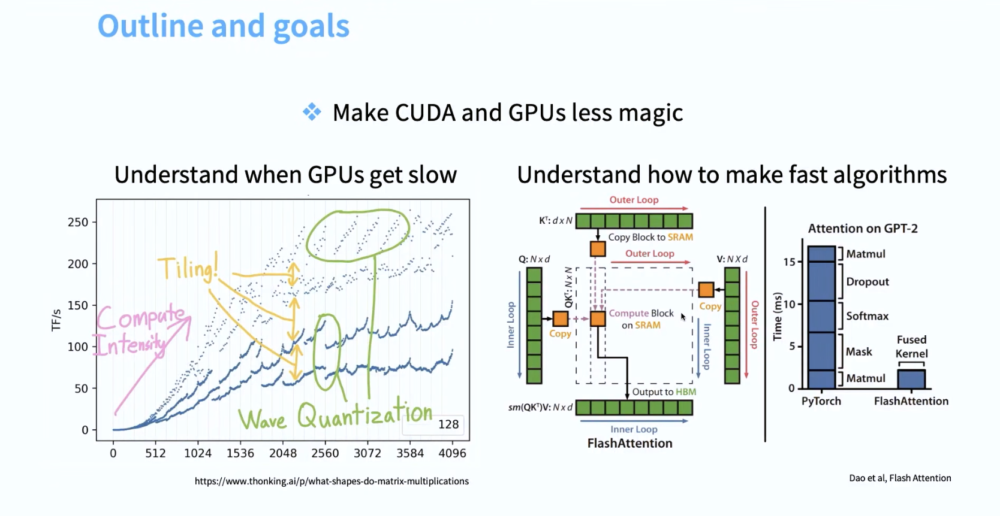
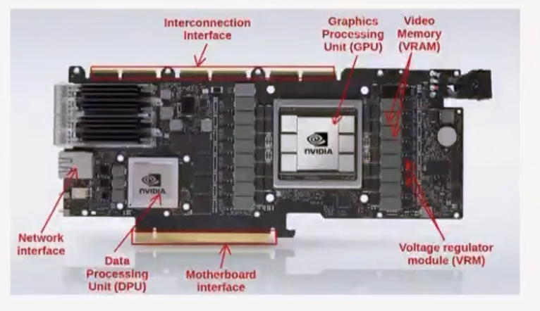
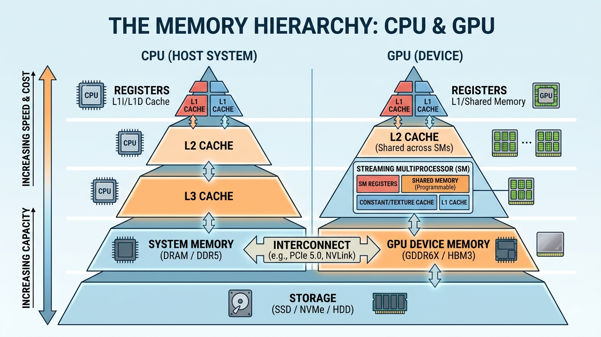

# GPUs and Flash Attention

- [🎥 Video from Stanford CS365](https://youtu.be/izZba4UA7iY?si=a_bvCFDrPPfPbN3e)

- what will you learn by the end of this?

## What does a GPU look like?

## Resources

- [Horace He blog](https://horace.io/brrr_intro.html)

- [How to scale your model TPU book](https://jax-ml.github.io/scaling-book/)

## 🤔 Question for class

- Do you think deep learning/LLMs can beat humans at everything?
- [📝 Rich Sutton's Bitter Lesson](https://gwern.net/scaling-hypothesis#if_slide_2)
- [Can just stacking more layers help?](https://gwern.net/scaling-hypothesis#if_slide_7)

## 🤔 Question for class

- 🤔 why would increasing the size of a matrix make _matmul_ faster? 

- [📝 Read this in class or question in class](https://www.thonking.ai/p/what-shapes-do-matrix-multiplications)

## Animation of how GPU/TPU works

- from the amazing [book on how to scale your model TPU book](https://jax-ml.github.io/scaling-book/)

- What is a TPU? See [link](https://jax-ml.github.io/scaling-book/tpus/)

- 💡 TPUs are very, very fast at matrix multiplication.

## Introduction

- Denard scaling, clock scaling
- cannot make clocks go faster
- have more things execute in parallel
- _Concept_ 🧩 🚀 CPUs optimize for a few fast threads while GPUs optimize for many many many threads

- [🎥 demystify GPU video](https://youtu.be/izZba4UA7iY?si=KsuXUlluPifrZo-f&t=557)

- Each SM has many SP (streaming processors)
- Each SM has can execute in parallel

- GA100 has 128 SMs

- _Concept_ 🧩 🚀 The closer the memory to SM, the faster it is: `L1` and shared memory is inside the SM. `L2` cache is on die, global memory are on memory chips next to GPU

- L1 and L2 cache is shared memory (SRAM): more expensive and more power hungry

- SRAM is 8x faster than HBM

    

## Software model

- SIMT (Single Instruction, Multiple Threads): threads work in parallel but same instruction, but different inputs
- Blocks of 32 threads are called warps
- Threads execute in groups
- decreases overhead on scheduling

## TPU

- TPU (Tensor Processing Unit) by Google
- optimized for matrix multiplication

## Back to GPUs

- `Matmul` is faster than floating point operations (additions, multiplications)

- compute is scaling faster than memory

- memory bandwidth is the bottleneck

### Summary

- [video of summary 🎥](https://youtu.be/izZba4UA7iY?si=u7XoJwguzp5HTgDD&t=1625)

## Recent trends

- Prefill phase is memory bound
 and is one chip

- Decoding is compute bound
 and is another chip
- attention can go to one chip; MLP will go to another chip

## TODO 📚: Questions Assignment

- TODO 📚: question written assignment on this (theory) 

## TODO Practical

- TODO Practical see Stanford CS365 practical on GPUs.

- [Practical on counting FLOPS using `PyTorch`](https://dev-discuss.pytorch.org/t/the-ideal-pytorch-flop-counter-with-torch-dispatch/505) and [here using `TorchDispatchMode` ](https://pastebin.com/V3wATa7w)

