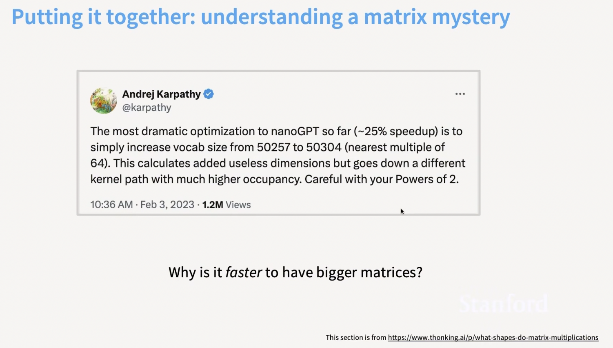
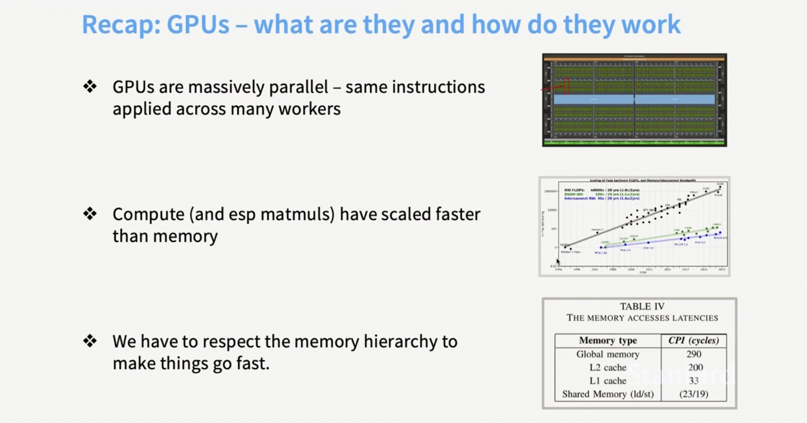
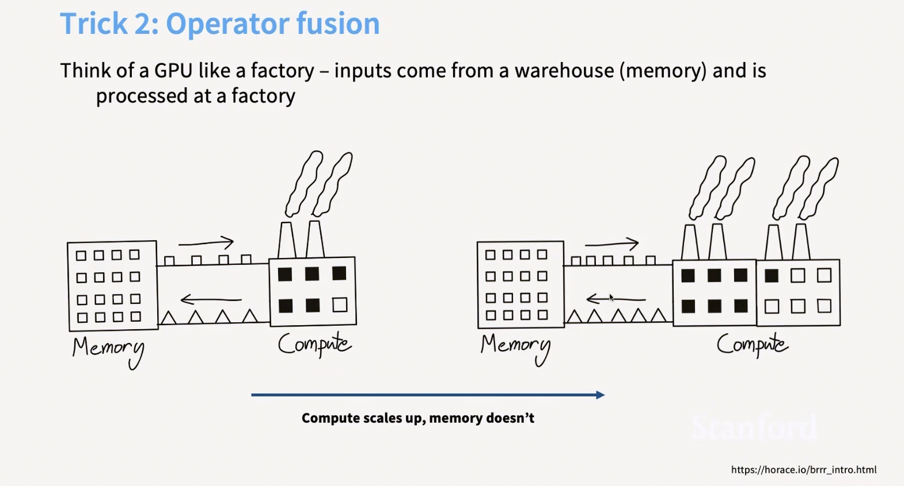
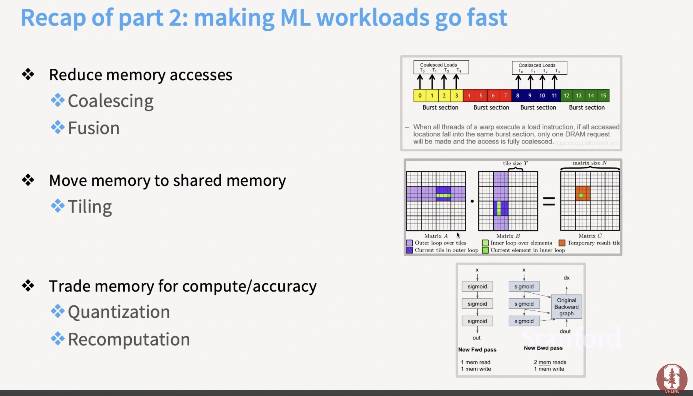
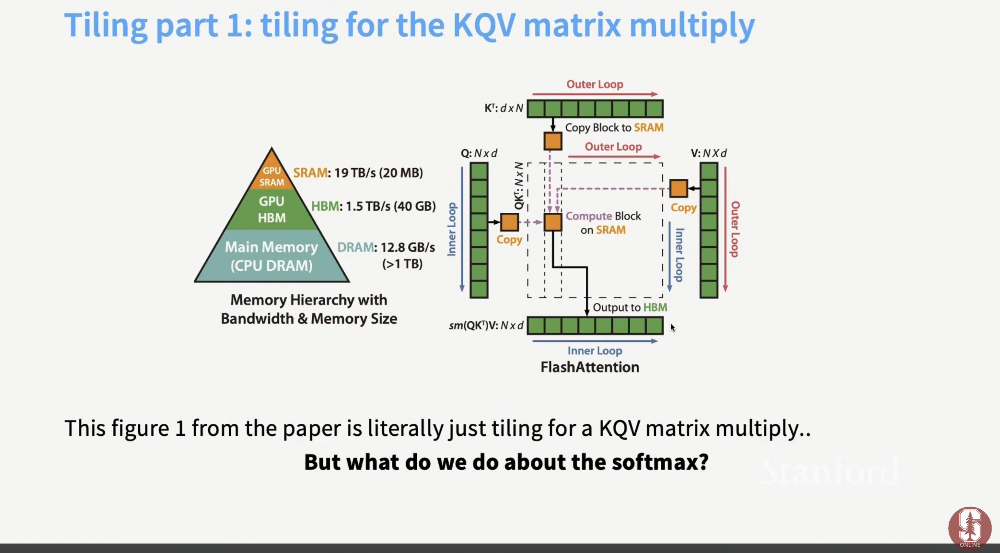
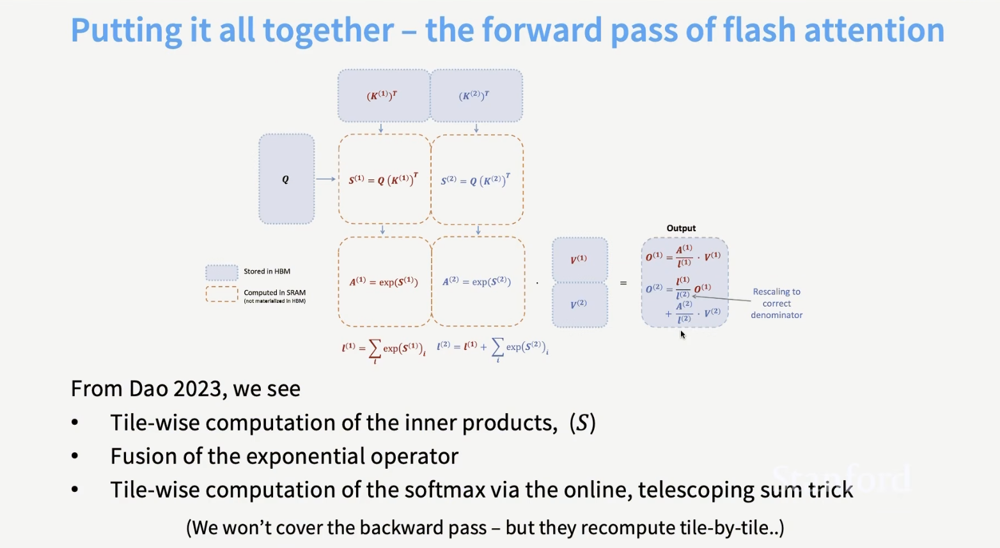

# GPUs and Flash Attention

- [🎥 Video from Stanford CS365](https://youtu.be/izZba4UA7iY?si=a_bvCFDrPPfPbN3e)


## 🤔 ❓Question

- Matrix mystery 🧩 🚀: Why is it faster to have a bigger matrix?

- Tweet by Andrei Karpathy




## Motivation

- what will you learn by the end of this?


## What does a GPU look like?


## Resources

- [Horace He blog](https://horace.io/brrr_intro.html)

- [How to scale your model TPU book](https://jax-ml.github.io/scaling-book/)

## 🤔 Question for class

- Do you think deep learning/LLMs can beat humans at everything?
- [📝 Rich Sutton's Bitter Lesson](https://gwern.net/scaling-hypothesis#if_slide_2)
- [Can just stacking more layers help?](https://gwern.net/scaling-hypothesis#if_slide_7)

## 🤔 Question for class

- 🤔 why would increasing the size of a matrix make _matmul_ faster? 

- [📝 Read this in class or question in class](https://www.thonking.ai/p/what-shapes-do-matrix-multiplications)


## Animation of how GPU/TPU works

- from the amazing [book on how to scale your model TPU book](https://jax-ml.github.io/scaling-book/)


- What is a TPU? See [link](https://jax-ml.github.io/scaling-book/tpus/)


- 💡 TPUs are very, very fast at matrix multiplication.


## Introduction

- Denard scaling, clock scaling
- cannot make clocks go faster
- have more things execute in parallel
- _Concept_ 🧩 🚀 CPUs optimize for a few fast threads while GPUs optimize for many many many threads


- [🎥 demystify GPU video](https://youtu.be/izZba4UA7iY?si=KsuXUlluPifrZo-f&t=557)

- Each SM has many SP (streaming processors)
- Each SM has can execute in parallel

- GA100 has 128 SMs

- _Concept_ 🧩 🚀 The closer the memory to SM, the faster it is: `L1` and shared memory is inside the SM. `L2` cache is on die, global memory are on memory chips next to GPU

- L1 and L2 cache is shared memory (SRAM): more expensive and more power hungry

- SRAM is 8x faster than HBM

    


## Software model

- SIMT (Single Instruction, Multiple Threads): threads work in parallel but same instruction, but different inputs
- Blocks of 32 threads are called warps
- Threads execute in groups
- decreases overhead on scheduling


## TPU

- TPU (Tensor Processing Unit) by Google
- optimized for matrix multiplication

## Back to GPUs

- `Matmul` is faster than floating point operations (additions, multiplications)

- compute is scaling faster than memory

- memory bandwidth is the bottleneck

### Summary

- [video of summary 🎥](https://youtu.be/izZba4UA7iY?si=u7XoJwguzp5HTgDD&t=1625)

## Recent trends

- Prefill phase is memory bound
 and is one chip

- Decoding is compute bound
 and is another chip
- attention can go to one chip; MLP will go to another chip


## Recap



- we do not get to control the _L1_ cache

- physical distance makes it slower

- We can do more operations per second than we can move data. 

- inference is more _memory bound_ than training

## Control divergence

- SMIT thread

- On CPU `if-else` is easy
- On GPU threads execute in groups of 32 (warps) and all threads in a warp must execute the same instruction.
- If some threads in a warp take the `if path` and others take the `else path`, 

## Low precision computation

- number repreentation
- fp16, 

- half memory to move
- low precision improves arithmetic intensity


- weights and activations may be low precision for matrix multiplications

- exponential and softmax need higher precision

- _Concept_ 🧩 🚀 empirical work on which of these operations can be low precision

- with mixed precision, _transpose_ becomes an expensive operation

- 🤔 ❓how to solve it?

- make two copies of the matrix
: one _original_ and another for the _transpose_

- transposes are also quantized


- what happens during training? what happens in inference?

- `matmul` getting quantized

- if matmul is quantized, what does it mean?
- does it mean we dont use mixed precision during training?
- does it mean we dont use low precision during training

- in _inference_ we use lower precision ?
- in _training_ we use higher precision ?

- [ ] 📝 Write out other questions in [assessments](assessments.md) related to GPUs

- can quantize activations after `ReLU`

- however more bang by quantizing `matmul`

- train a bigger model and then quantize it?

## Operator fusion



- how many cycles for computing sin^ x + cos^x ?


- `cuda.compile` will collapse the computation graph

- or read once in GPU memory, do the computation in _SM_ and then write the result back to _global memory_

- backprop memory used


- _Concept_ 🧩 🚀 backpropagation intuition


- 💡 in a world where memory is slower and compute is cheap/faster, you just recompute the activations!


### Burst mode of DRAM/global memory

- a single read will return 128 byte blocks

- memory access is _coalesced_

- _NOTE_: a `warp` is a set of 32 threads that execute together and memory access happens together

- row addressing

- coalescing for matrix multiplication (row major)

## Tiling

- respect memory hierarchy

- cut your matrix into tiles

- and compute your `matmul`

- by loading them from global memory to shared memory

- once in shared memory I can read and write very fast

- 🤔 ❓ Is this problem `NP-hard`?

- TODO: Practical idea: PyTorch `maxautotune` benchmarking tile size and which is faster

### Circling back to motivation

- Matrix mystery 🧩 🚀: Why is it faster to have a bigger matrix?

- Tweet by Andrei Karpathy


- pad to get a speedup

- shift your rows to get a speedup (tiling)

- 🤔 ❓ Now explain how you get this unexplained drop in throughput when you go from 98 tiles to 120 tiles on an A100


- wave quantization

## Recap



- SRAM energy hungry

## Flash Attention

- Also see [Flash attention notes](flash_attention.md)

- Tiling and recomputation

- _Recall_: Attention is 3 matrix multiplies and a _softmax_

- Tiling for KQV matrix multiply



- softmax?

- online softmax

- calculate softmax tile-by-tile

- incrementally update the max and setup a telescoping sum

- forward pass in flash attention in HBM and SRAM



- recomputation: do not store activations in memory, just recompute on backward pass

## Key takeaways

- In GPU, think about `matmul` and data movement

- Thinking carefully about memory: tiling, recomputation, operator fusion

- _Concept_ 🧩 🚀 architecture, systems and software interact


## Benchmarking and profiling

- [🎥 Video by Perci Liang CS365 Stanford](https://youtu.be/xnDHaNUvHBg?si=9Es8zZqMiIiDWt-F&t=1368)

- do warmups since some things are _lazy_ compiled

- time it multiple times

- `torch.cuda.Event(enable_timing=True)`: start and stop timers

- `torch.cuda.synchronize()`: wait for all GPU operations to complete

- everything on GPU is _asynchronous_

- profiler

- `torch.profiler.profile`

```python
add_profile = profile(run_operation2(dim=2048, operation = lambda a, b: a + b))
```

- [🎮🎥 also see video on benchmarking and profiling by Dr. Percy Liang Stanford CS336](https://youtu.be/xnDHaNUvHBg?si=64rcwR0sYLKlS89B&t=1854)

- PyTorch has built in GeLU approximation

```python
import torch

def builtin_gelu(x: torch.Tensor):
    return torch.nn.functional.gelu(x, approximate="tanh")
 ```

- 🎮 more practical code [here](https://cs336.stanford.edu/lectures/?trace=lecture_06)

- In the context of GPUs and Large Language Models (LLMs), Triton (originally developed by OpenAI) is an open-source, Python-embedded domain-specific language (DSL) and compiler designed for writing highly efficient, custom GPU kernels

- It acts as a middle ground between high-level frameworks like PyTorch and low-level GPU programming languages like CUDA (NVIDIA) or ROCm (AMD). Instead of writing complex C++ code, developers can write Pythonic code that Triton compiles directly into optimized machine instructions.


- PyTorch 2.0+: Triton is the primary engine behind PyTorch Inductor (the default compiler backend for torch.compile). It automatically generates optimized Triton kernels for your model code.

- vLLM: Popular inference engines like vLLM rely on Triton attention backends to compute heavy workloads like Paged Attention. This approach allows inference frameworks to stay lightweight and avoid heavy, vendor-specific binary dependencies.

```python

import os
import time
from typing import Callable
import torch
from torch.profiler import ProfilerActivity
import triton
import triton.language as tl
from edtrace import text, link, image
from lecture_util import get_local_url
from gpu_util import cuda_if_available

def main():
    # Last lecture: high-level overview of GPUs and performance
    # This lecture: benchmarking/profiling + writing kernels
    # review_of_gpus()
    benchmarking_and_profiling()           # Where are the bottlenecks?
    naive_vs_builtin_vs_compiled_gelu()    # Apply it to the GeLU example
    # Write Triton kernels

def benchmarking_and_profiling():
    # Recipe for success:

    # Benchmark and profile your code
    
    # Make changes
    
    # Benchmark and profile your code again
    
    benchmarking()   # How long does it take?
    
    profiling()      # Where time is being spent?
    
    # Benchmark and profile your code!

def benchmarking():
    # Benchmarking measures the wall-clock time of performing some operation.
    # It only gives you end-to-end time, not where time is spent (profiling).
    # It is still useful for:
    
    # comparing different implementations (which is faster?), and
    
    # understanding how performance scales (e.g., with dimension).
    
    # You can use torch.utils.benchmark.
    # We will roll our own to make benchmarking more transparent.
    
    # Benchmark matrix multiplication
    
    matmul = run_operation2(dim=1024, operation=lambda a, b: a @ b)
    result = benchmark(matmul)  
    
    # See how timing scales with dimension
    results = {}
    for dim in [256, 512, 1024, 2048, 4096, 8192]:
         results[dim] = benchmark(run_operation2(dim=dim, operation=lambda a, b: a @ b))  
    # Note: time is roughly constant when dimension is small, then cubic scaling.

def benchmark(run: Callable, num_warmups: int = 1, num_trials: int = 3) -> float:
    """Benchmark `func` by running it `num_trials`.  Return the average time."""
    # Warmup: first times might be slower due to compilation, etc.
    # Since we will run the kernel multiple times, the timing that matters is steady state.
    for _ in range(num_warmups):
        run()
    torch.cuda.synchronize()  # Wait for CUDA threads to finish (important!)
    # Time it for real now!
    times: list[float] = [] 
    for trial in range(num_trials):  # Do it multiple times to capture variance
        # Use CUDA events for accurate GPU timing (avoid capturing CPU overhead)
        start_event = torch.cuda.Event(enable_timing=True)
        end_event = torch.cuda.Event(enable_timing=True)
        start_event.record()  # Start timing
        run()  # Actually perform computation
        end_event.record()  # End timing
        torch.cuda.synchronize()  # Wait for CUDA threads to finish
        times.append((start_event.elapsed_time(end_event))) 

    mean_time = mean(times)   
    return mean_time


def profiling():
    # While benchmarking looks at end-to-end time, profiling looks at where time is spent.
    # Independent of time, profiling also helps you understand what's going under the hood.
    # PyTorch has a built-in profiler.
    # In your assignment, you will use nsight to get more details.
    add(dim=2048)
    add_profile = profile(run_operation2(dim=2048, operation=lambda a, b: a + b))

    matmul_profile = profile(run_operation2(dim=2048, operation=lambda a, b: a @ b)) 

    matmul_profile = profile(run_operation2(dim=128, operation=lambda a, b: a @ b)) 


def naive_vs_builtin_vs_compiled_gelu():
    # Let's benchmark and profile the GeLU activation function.
    x = torch.tensor([1.])  
    # 1. Implementation naively from scratch in PyTorch (non-fused)
    y1 = naive_gelu(x)  
    # 2. Built-in PyTorch implementation (fused)
    y2 = builtin_gelu(x) 

    check_equal_1d(naive_gelu, builtin_gelu)  # Check it works
    # 3. Use PyTorch compiler on the naive implementation
    compiled_gelu = torch.compile(naive_gelu)  

    y3 = compiled_gelu(x)  

    check_equal_1d(naive_gelu, compiled_gelu)  # Check it works (compilation shouldn't change semantics) 
    # Benchmarking
    naive_time = benchmark(run_operation1(dim=16384, operation=naive_gelu)) 

    builtin_time = benchmark(run_operation1(dim=16384, operation=builtin_gelu)) 

    compiled_time = benchmark(run_operation1(dim=16384, operation=compiled_gelu)) 
    # The builtin and compiled versions are significantly faster!
    # To understand why, let's look at the profiler to see where time is being spent.
    # naive_gelu
    naive_gelu_profile = profile(run_operation1(dim=16384, operation=naive_gelu))  

```


## TODO 📚: Questions Assignment

- TODO 📚: question written assignment on this (theory) 

- see [assessments](assessments.md)


## 🎮 TODO Practical

- TODO: In GPU, think about `matmul` and data movement

- TODO: Flash Attention in pytorch


- TODO 🎮 Practical see Stanford CS365 practical on GPUs [here](https://github.com/stanford-cs336/assignment2-systems/blob/main/cs336_assignment2_systems.pdf)

- [Practical on counting FLOPS using `PyTorch`](https://dev-discuss.pytorch.org/t/the-ideal-pytorch-flop-counter-with-torch-dispatch/505) and [here using `TorchDispatchMode` ](https://pastebin.com/V3wATa7w)


