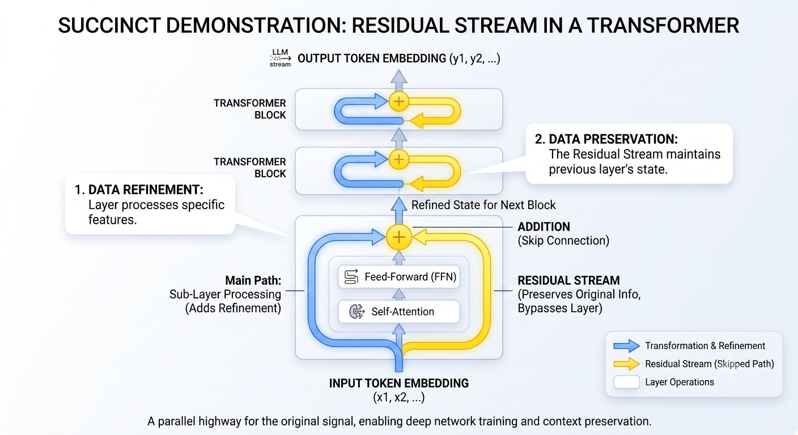
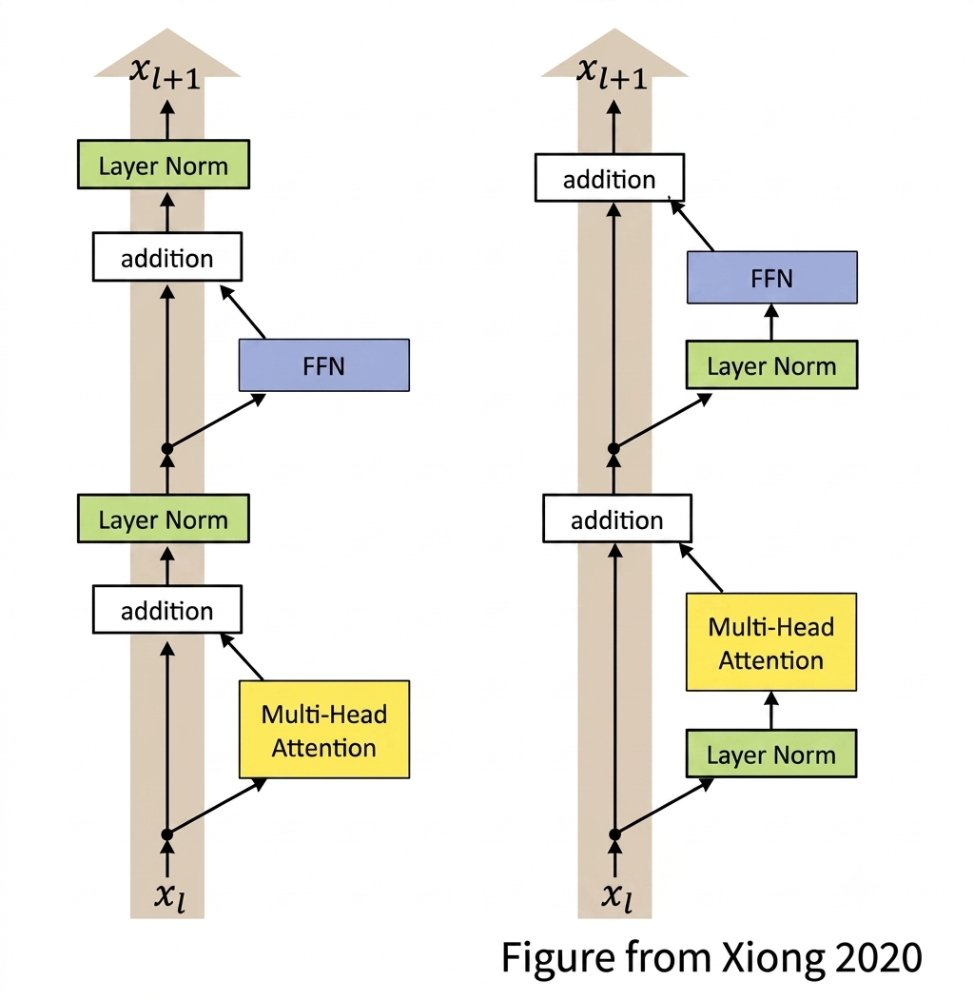
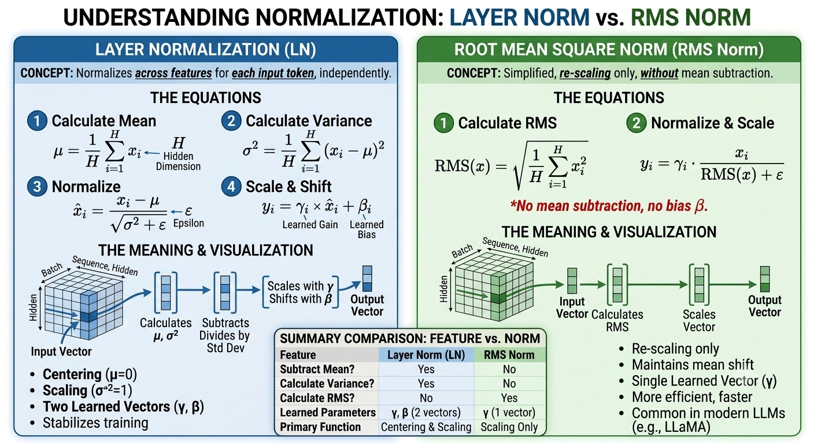
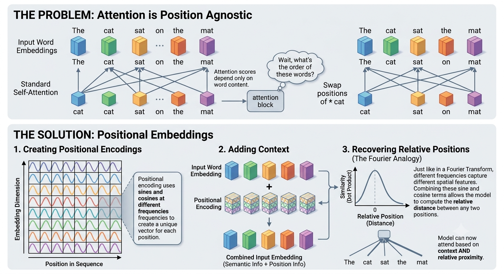
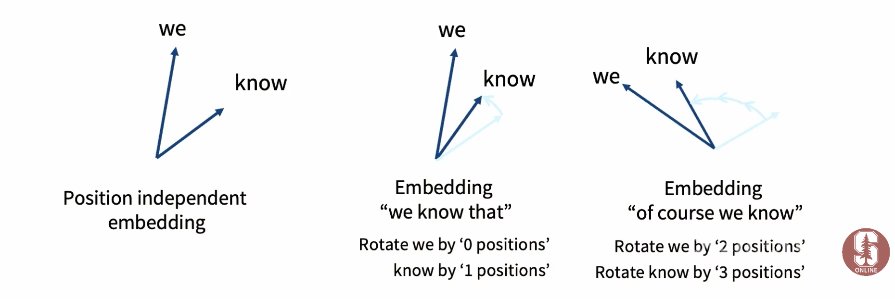
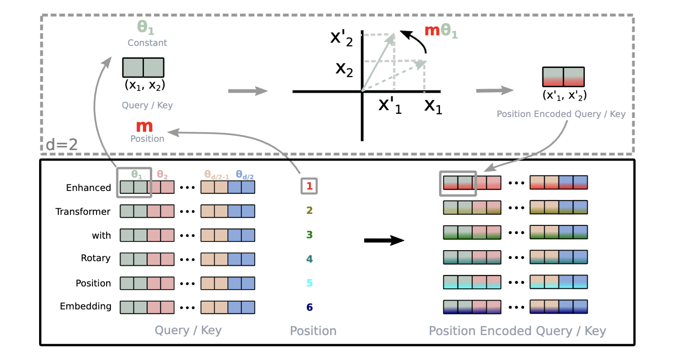

# Architectures (Stanford CS 336)

- [🎥 Video lecture from Stanford CS336 course](https://youtu.be/lVynu4bo1rY?si=nXDSMP5oy4CJt4Mh)

## Intro

- Positional embedding (sines and cosines)

- FFN: ReLU

- LayerNorm, post-norm

## 🎮 Practical

- SWIGLU in FFN
- Rotary Positional Embeddings
- Linear layers (have no bias terms)
- LayerNorm in front of the block

- `Llama`
- why choose these?

## Zoo of models

- why so many models/architectures?
- 🤔 stabilty tricks (during training)
- how many vocab elements?
- train efficiently on GPUs
- `QK-norm`
- Hybrid attention
- lots of experimentation

- _Concept_ 🧩 🚀 💡 architecture modifications that make training more stable
- when `Llama 2` came out, everyone started making minor modifications to it

## Residual stream

- The residual stream operates as a "parallel highway" for information within a Transformer block.

- The Main Path (blue arrows): As data moves through the Self-Attention and Feed-Forward layers, it is refined and transformed to learn complex patterns and relationships.

The Residual Stream (yellow arrows)::

- This path allows the original, unprocessed input from the previous layer to skip directly to the block's end, where it is added back to the processed signal.

- This mechanism is fundamental for Large Language Models because it ensures that the model preserves previous context and original information as it gets deeper. 

 - Without this direct pathway, essential context could be lost during the heavy processing required at each layer, making it impossible to train deep networks effectively.

 

 

- 💡 without residual connections, the information flow would be bottlenecked at each layer, making it difficult for the model to learn long-range dependencies or retain information across deep stacks of layers. 

## Pre vs. Post norm

- Original transformer paper residual layer (post norm)
- GPT 2, 3, Llama 2 are pre-norm

### Why Pre-norm?

- helps with training stability
- smoother gradient flow

- ⚠️ All modern LLMs push the layer norm outside the residual stream (but before the compuations/multi-head attention)

- Residual layer has the norm

- keep your residual stream clean
- allow gradients to flow backwards more easily

- [🎥 gradients are stable during training](https://youtu.be/lVynu4bo1rY?si=XvpNpyE-wAOdeZzg&t=715)

## Double norm

- LayerNorm at the beginning and/or end of Multi-Head Attention (MHA) and Feed Forward Network (FFN) _but_ still outside the residual stream

## Why Layer Norm?

- LayerNorm: normalize the input features (per token) across the hidden dimension

- RMSNorm: does not add a bias term unlike layer norm or subtract mean , it only normalize by the square root of the mean square

- RMSNorm is faster computationally

- 💡 This is where architecture interacts with system design. 

- Think back to [arithmetic intensity and the need to keep the GPUs busy](resource_accounting.md)

- do not move memory back and forth between memory and the compute units

- inefficient use of GPU

- FLOPS important but runtime is what matters for inference speed

- Keep the GPUs fed!

- [🎥 Normalization can be upto 25% of total runtime!](https://youtu.be/lVynu4bo1rY?si=sN3xwuSZAYirGlIS&t=979)

- RMSNorm can still matter due to _data movement_

    
## Bias terms 

- Bias terms not helpful for transformers

- Original transformer FFN(x) = max(xW1 + b1, xW2 + b2) + b3
- Llama 2 FFN(x) = (xW1 + b1, xW2 + b2, xW3 + b3)   

- Most implementations now: FFN(x) = sigma(xW1)W2

- reasons: memory, efficiency, training stability

- get the easy systems win!

- drop bias terms: keep the system more arithematically intense

- you do lots of experiments: no way to know what will work beforehand

## Zoo of activations

- [🎥 Zoo of activations](https://youtu.be/lVynu4bo1rY?si=fXi-WhvRNLUACmxy&t=1226)

- ReLU: FF(x) = max(0, xW1) W2 used in `Chinchilla`
- GeLU:  Gaussian noise around 0 (used in `GPT-2`)

- Gated ReLU (reGLU): gating is very effective

- SwiGLU: swish is x * sigmoid(x)

- 💡 GLUs (gated) are better at loss (not much loss in computational cost)

## Serial vs Parallel 

- normal transformer blocks are _serial_: they compute attention and then FFN/MLP

- serial still preferred (depth loss deleterious)

## Position embeddings

- attention is position agnostic
- so need a way to represent position

- _Concept_ 🧩 🚀 if you have `sines` and `cosines` then you can recover relative positions (similar to a _Fourier transform_)

- Absolute embeddings : 

- Relative embeddings : add a vector to the attention mechanism

- Rope embeddings: RoPE (Rotary Position Embedding) : 

- inner products are invariant to arbitrary rotations

- we want embeddings to be position dependent

- RoPE intuition : _Concept_ 🧩 🚀

Image from [🎥 Stanford CS336 course](https://youtu.be/lVynu4bo1rY?si=iBPlo_FLjIVDSMc-&t=2155)

- now you can take inner products

- what do you in _d_ dimensions? How do you rotate in higher dimensions?

- low frequency parts (f1) change slowly, high frequency parts (f2) change quickly

- 📝 Image from [Paper on ROPE](https://arxiv.org/pdf/2104.09864)

- _Gemma_ has proportional rotary position embeddings (PROPE): just rotate first two

### 🎮 Practical: implementation and code for ROPE

- [🎥 Video on Stanford CS336](https://youtu.be/lVynu4bo1rY?si=FfdXX59mB43Ju7UV&t=2311)

- [📝 Notebook](../images/practical_rope.png)

- [📝 Notebook](../practicals/rope_practical.py)

- [📝 Notebook](../practicals/rope_practical_solutions.py)

## Consensus hyperparameters

- `dff = 4 * d_model`
- dff (feedforward dimension)
- d_model (model dimension)
- richness of your MLP (multi layer perceptron)

- Exceptions: GLU variants

- `T5`: 64 multiplier to keep GPU busy

## Consensus hyperparameter 2

- Multi head attention

- [How many heads](https://youtu.be/lVynu4bo1rY?si=3xPGar6HAPEt8OjT&t=3063)

## Aspect ratio

- aspect ratio: deep vs. shallow

- `aspect ratio = d_model / n_layer`

- approx. 100 for most models

 - 100 deep for every layer 

- deep models are hard to parallelize (Tay et al 2021)

- `expressiveness` reasons to go deep

- `systems` reasons to go wide

## Vocabulary size

- Original Transformer (37k tokens)
- Larger vocabulary -> larger embedding matrix

- multi-modal models (images and text): use larger vocabulary with its own image tokenizer and image vocab

## Dropout and regularization

 

