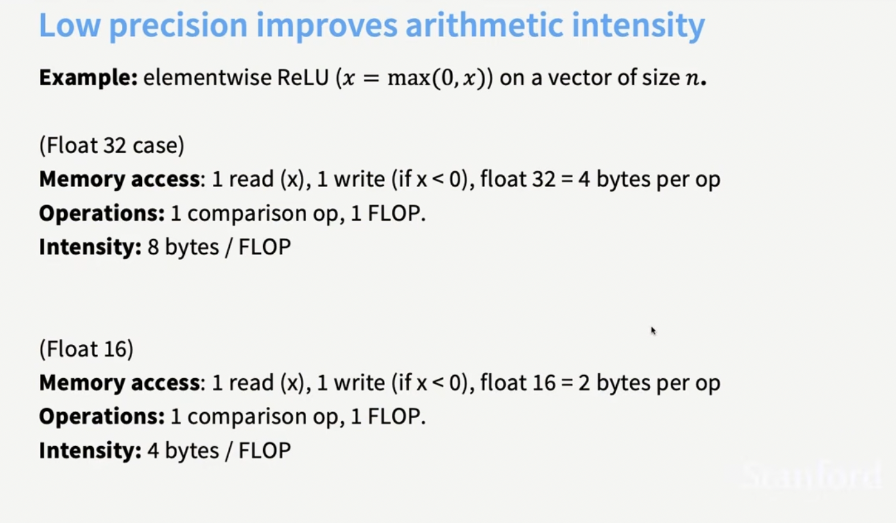
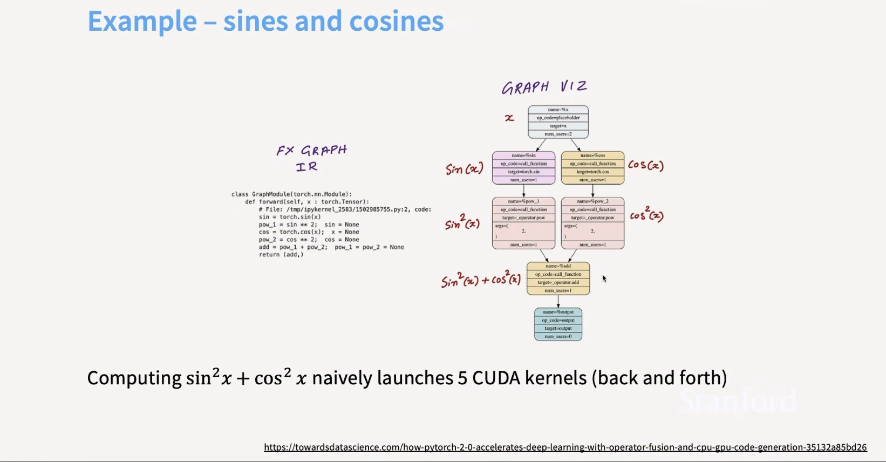
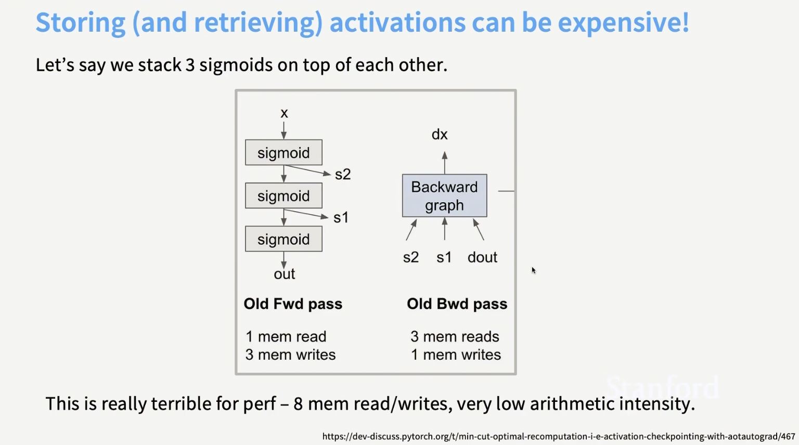
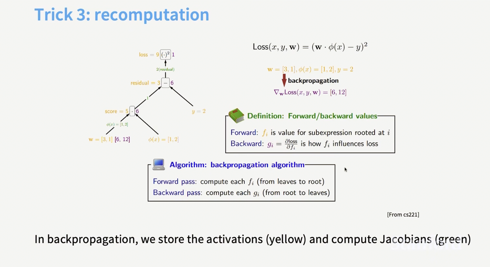
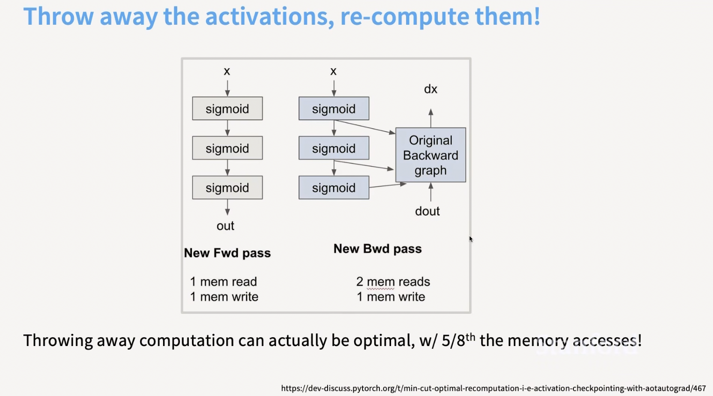
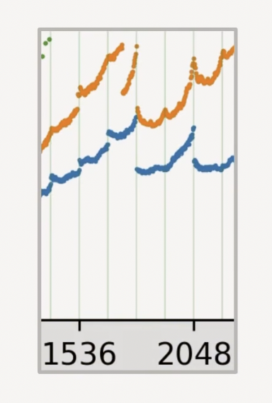

# Assessment

- Written component
- Software component/practical

## Written component

- Tradeoff between KV cache, memory management, saving sessions on Claude and restoring them from hard disk, L1 cache management, L2 cache, DRAM
- Engineering choices
- How does KV cache interact with architecture/hyperparameters? (such as optimizers, depth vs. width ). See [architecture](architecture.md)
- How does KV cache interact with software choices? 
- Distributed file systems

- also quantization

- How does this interact with the following points covered in the chapter on [GPU and Flash Attention](GPUs.md)?

- Prefill phase is memory bound
 and is one chip

- Decoding is compute bound
 and is another chip
- attention can go to one chip; MLP will go to another chip

- Come up with a new architecture where different parts of the Transformer such as attention, MLP, layer norm are placed on different chips and analyze the trade-offs in terms of performance and memory usage.

- theory exam on how many FLOPS for `ReLU` and how to speed it up

- can quantize activations after `ReLU`

- however more bang by quantizing `matmul`

- train a bigger model and then quantize it?

- 📝 how many cycles for computing sin^ x + cos^x ?

- backprop memory used

- _Concept_ 🧩 🚀 backpropagation intuition

- 💡 in a world where memory is slower and compute is cheap/faster, you just recompute the activations!

- explain how you get this unexplained drop in throughput when you go from 98 tiles to 120 tiles on an A100 GPU

## Practical
- Implement an LLM-based application for low resource scenarios
    
