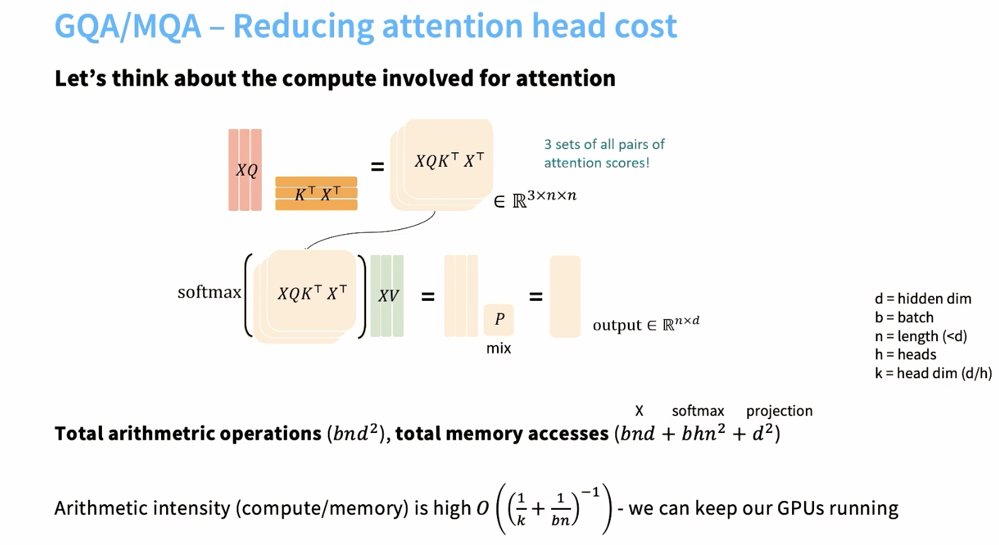
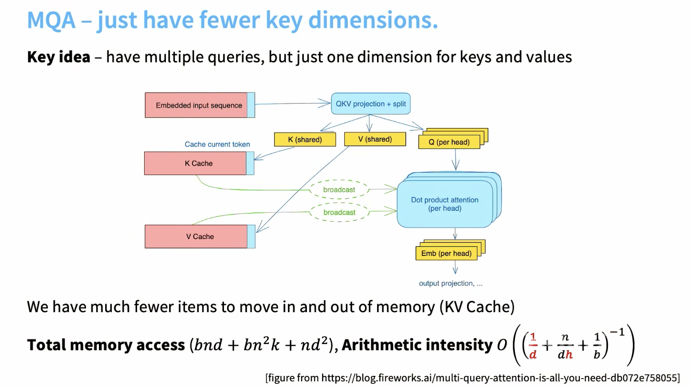
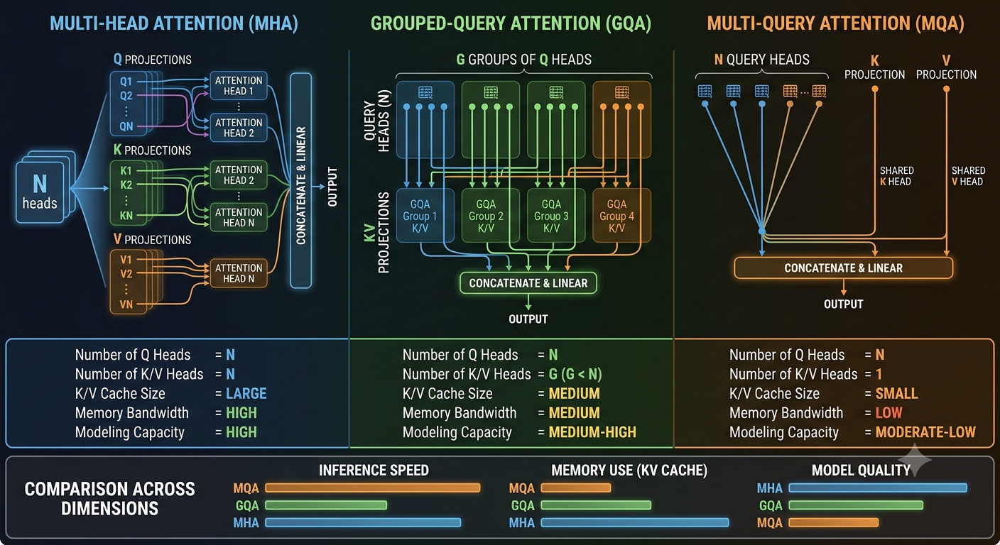
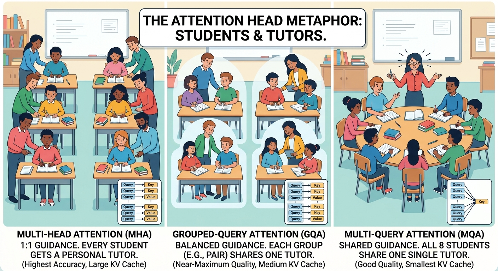

# Different kinds of attention

- [🎥 Video by Vizuara](https://www.youtube.com/shorts/s11Zp5mpWlE)


- Multi-Head Attention (MHA)
- Grouped-Query Attention (GQA)
- Multi-Query Attention (MQA)

## Multi-Query-Attention (MQA)


- [🎥 video on MQA Stanford CS365](https://youtu.be/lVynu4bo1rY?si=O8-FEmpsikcQ0HGl&t=4781)






## Reading VERY GOOD

- [link](https://fireworks.ai/blog/multi-query-attention-is-all-you-need)

- [link for KV caching explained](https://medium.com/@joaolages/kv-caching-explained-276520203249)


## Intuition

Think of attention as a team of researchers trying to answer questions using a library: **Queries** are the questions asked, **Keys** are book index topics, and **Values** are the actual textbook contents.






**Multi-Head Attention (MHA)**

* **Concept:** Every Query head gets its own dedicated Key and Value head.
* **Classroom Analogy:** Imagine 8 students working on a project, and every single student gets their own personal tutor.
* **Takeaway:** Highest accuracy and detail, but extremely slow and memory-intensive because every tutor needs room to work.

**Multi-Query Attention (MQA)**

* **Concept:** All Query heads share a single Key and Value head.
* **Classroom Analogy:** Imagine 8 students working on a project, but all 8 students have to share one single tutor.
* **Takeaway:** Ultra-fast and light on memory, but quality drops because one tutor gets overwhelmed managing everyone's queries.

**Grouped-Query Attention (GQA)**

* **Concept:** Query heads are split into small clusters, and each cluster shares a Key and Value head.
* **Classroom Analogy:** Imagine 8 students split into 4 pairs, where each pair shares one tutor.
* **Takeaway:** The "Goldilocks" solution. It delivers almost the same quality as MHA while retaining most of MQA's speed and low memory footprint (used in models like Llama 3).

| Feature | Multi-Head (MHA) | Grouped-Query (GQA) | Multi-Query (MQA) |
| --- | --- | --- | --- |
| **Analogy Setup** | 1 tutor per student | 1 tutor per small group | 1 tutor for the whole class |
| **Memory Usage** | Very High | Low–Medium | Extremely Low |
| **Speed** | Slow | Fast | Ultra Fast |
| **Model Quality** | Maximum | Near-Maximum | Reduced |


## Resource on GPUs

- See chapter on [GPUs](GPUs.md)


## Deep dive

- frame the progression as an evolution driven by real-world hardware limits rather than abstract math.


1. **Self-Attention (The Core Idea):** Start with sentence context. In *"The animal didn't cross the street because **it** was too tired,"* self-attention is the spotlight mechanism that lets "it" focus on "animal" instead of "street."
2. **Multi-Head Attention (MHA):** Explain that words have multiple relationships at once. One head tracks grammar (subject-verb), another tracks pronouns, and a third tracks tone. Multiple heads let the model look at the sentence through different lenses simultaneously.
3. **The Memory Wall (The Bottleneck):** Introduce **Inference Hardware**. Storing all those distinct memory heads (the Key-Value Cache) for long conversations consumes massive GPU memory, making MHA slow and expensive to run in production.
4. **MQA & GQA (Engineering Trade-offs):** Frame MQA as the extreme memory-saving shortcut, and GQA as the modern "Goldilocks" sweet spot used in models like Llama 3.

**Whiteboard Memory Trick**
Use a quick visual formula to show how memory scales during generation:

* **MHA:** $N$ Queries $\rightarrow$ $N$ Keys / $N$ Values *(Heavy Memory)*
* **GQA:** $N$ Queries $\rightarrow$ $G$ Groups of Keys/Values *(Balanced)*
* **MQA:** $N$ Queries $\rightarrow$ $1$ Shared Key / $1$ Value *(Ultra-Light)*

**5-Minute Classroom Activity**
Give students the sentence: *"The chef cooked the soup because it was cold."*
Ask them to map out what two distinct "heads" are looking at simultaneously:

* **Head 1 (Grammar Head):** Connects the verb *"cooked"* back to *"chef."*
* **Head 2 (Context Head):** Connects the pronoun *"it"* back to *"soup."*

This bridges the gap between human intuition and why models need multiple projections before jumping into code.

## 🎮 Practical activity

- Practical also available [here](../practicals/different_attention.py) 

```python
import torch

# Common dimensions
batch_size = 1
seq_len = 128
num_q_heads = 8
head_dim = 64

print("=== 1. MULTI-HEAD ATTENTION (MHA) ===")
num_kv_heads_mha = 8  # 1:1 ratio (8 Q heads, 8 KV heads)

q_mha = torch.randn(batch_size, num_q_heads, seq_len, head_dim)
k_mha = torch.randn(batch_size, num_kv_heads_mha, seq_len, head_dim)

print(f"Q shape: {list(q_mha.shape)}")
print(f"K shape: {list(k_mha.shape)} <-- Full memory footprint (8 heads)\n")

print("=== 2. GROUPED-QUERY ATTENTION (GQA) ===")
num_kv_heads_gqa = 2  # 4:1 ratio (8 Q heads share 2 KV heads)
group_size = num_q_heads // num_kv_heads_gqa

q_gqa = torch.randn(batch_size, num_q_heads, seq_len, head_dim)
k_gqa = torch.randn(batch_size, num_kv_heads_gqa, seq_len, head_dim)

print(f"Q shape:         {list(q_gqa.shape)}")
print(f"K shape (Cache): {list(k_gqa.shape)} <-- 75% smaller memory footprint!")

# Expand Key heads to match Query heads right before matrix multiplication
k_gqa_expanded = k_gqa.repeat_interleave(group_size, dim=1)
print(f"K shape (Math):  {list(k_gqa_expanded.shape)} <-- Expanded for dot-product")

```

- Tracking the head dimension ($N_{\text{heads}}$) directly reveals how Grouped-Query Attention reduces GPU memory overhead during generation compared to Multi-Head Attention.

- Key Takeaways to Point Out to Students

* **Memory Cache Shape:** MHA stores `[1, 8, 128, 64]` tensors in GPU VRAM, whereas GQA only stores `[1, 2, 128, 64]`. This 4x reduction in KV cache size allows LLMs to process much larger context windows.
* **The Trick (`repeat_interleave`):** GQA saves memory in VRAM, but briefly duplicates the Key/Value heads along the head dimension right before computing dot-product attention so matrix shapes still align: $(1, 8, 128, 64)$.