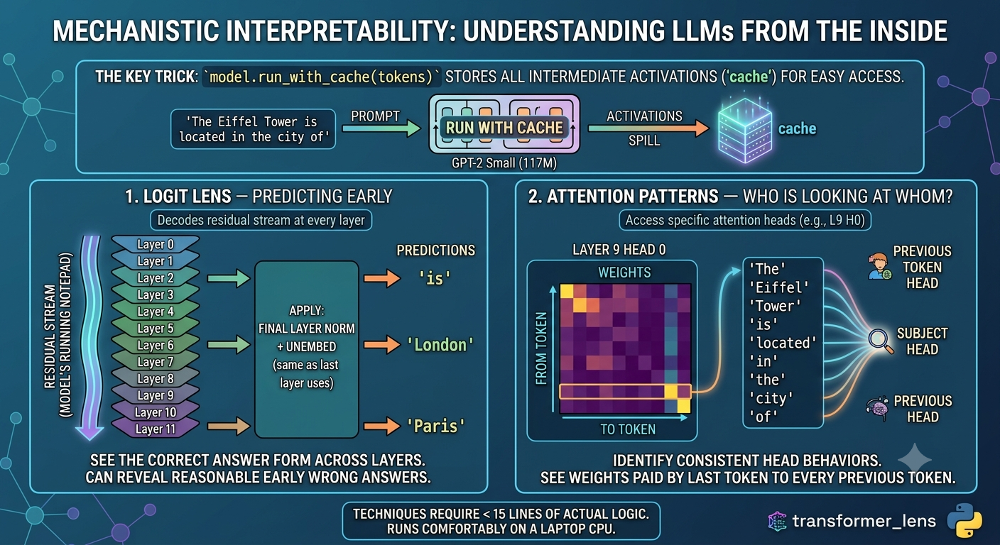
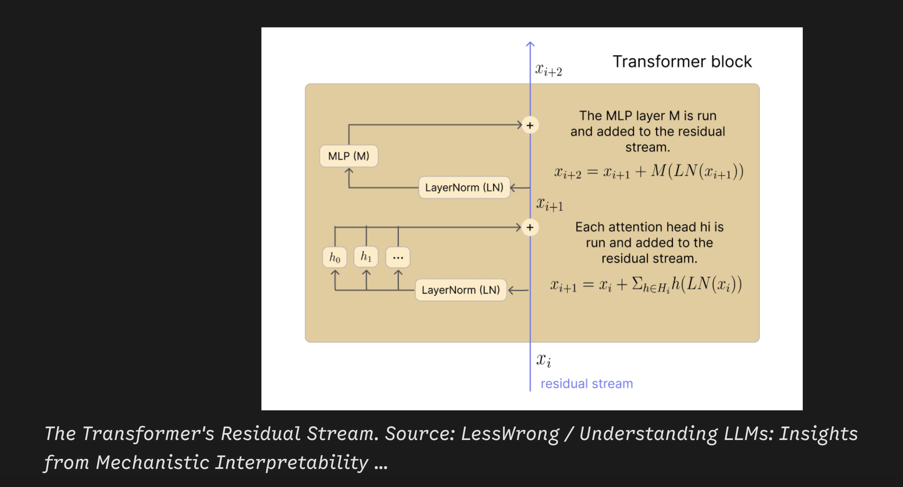

# Explainable AI in the context of LLMs and mechanistic interpretability

- Explainability from the social sciences (Miller et al. paper)

- Class-contrastive counterfactual

> Your loan was denied because your salary was less than 40K. If your salary was greater than 50K, your loan would have been approved.

- Black box models

- 🤔 ❓ What kinds of issues can crop up?

- Apply this to LLMs

## Reading about J-space Anthropic paper

- [J-space Anthropic paper](https://kenhuangus.substack.com/p/claudes-hidden-workspace-why-j-space) and [here](https://transformer-circuits.pub/2026/workspace/index.html)

## 📚 More reading

- [ 📚 Book by Neel Nanda](https://learn.arena.education/chapter1_transformer_interp/02_intro_mech_interp/)

- 📚 Read the following [review paper](https://dl.acm.org/doi/full/10.1145/3787104) and Neel Nanda's [blog](https://www.neelnanda.io/mechanistic-interpretability/glossary)

- [Linear probes](https://learn.arena.education/chapter1_transformer_interp/02_intro_mech_interp/)

## Python Libraries

- [TransformerLens](https://github.com/TransformerLensOrg/TransformerLens)

- [CircuitsVis](https://github.com/TransformerLensOrg/CircuitsVis)

## 🎮 Practical

- [🎮 Demo](https://transformerlensorg.github.io/CircuitsVis/?path=/story/activations-textneuronactivations--multiple-samples)


## Review of explainability

**REVIEW of exlainability**

- Review paper by John Miller: Explainability from the social sciences

- Post hoc attribution techniques, inherently interpretable architectures (e.g. decision trees or generalized additive models (GAMs)), and concept-based explanations do not open the black box

_NOTE_: 

- Read the following [review paper](https://dl.acm.org/doi/full/10.1145/3787104) and Neel Nanda's [blog](https://www.neelnanda.io/mechanistic-interpretability/glossary) that has this quote:

>specialized toolchains such as TransformerLens, CircuitsVis, and Neuroscope,researchers can map neurons, attention heads, and residual streams to interpretable computational motifs, paving the way toward transparent and auditable AI systems.

> Central challenges that confront Mechanistic Interpretability, including scalability to billion-parameter models, and entangled (polysemantic) features

>Mechanistic interpretability moves beyond post hoc analysis by reverse-engineering the internal computations of neural networks. Instead of correlating inputs and outputs, it identifies functional subgraphs–neurons, attention heads, and residual streams–that causally implement behaviors.

- `circuits microscope` for tracing activations. Read the [paper](https://distill.pub/2020/circuits/zoom-in/)

- image of sparse autoencoder


## 🎮 Demo

- [🎮 demo](https://transformerlensorg.github.io/CircuitsVis/?path=/story/activations-textneuronactivations--multiple-samples)


## 🎮 Practical: Mechanistic interpretability: short code in python and a small practical to demonstate this

- image summarizing the practical



```python
"""
Mechanistic Interpretability: a minimal, teachable demo
--------------------------------------------------------
Two techniques, both < 15 lines of actual logic each:

1. LOGIT LENS  -> "what would the model predict if it stopped early?"
2. ATTENTION PATTERNS -> "which tokens is a given head looking at?"

Install:
    pip install transformer_lens

This uses GPT-2 small (117M params) - small enough to run on a laptop CPU.
"""

import torch
from transformer_lens import HookedTransformer

# ---- 1. Load the model ----------------------------------------------------
model = HookedTransformer.from_pretrained("gpt2-small")
model.eval()

prompt = "The Eiffel Tower is located in the city of"
tokens = model.to_tokens(prompt)

# run_with_cache stores EVERY intermediate activation, keyed by name.
# This is the core trick that makes TransformerLens good for teaching:
# you get full internal access "for free".
logits, cache = model.run_with_cache(tokens)

print(f"Prompt: {prompt!r}")
print(f"Model's final answer: {model.to_string(logits[0, -1].argmax())!r}\n")

# ---- 2. Logit Lens: decode the residual stream at every layer -------------
# The residual stream is the running "memory" that every layer reads from
# and writes to. If we apply the model's final steps (layer norm + unembed)
# to an EARLY layer's residual stream, we get a sneak peek at what the
# model "believed" before later layers refined it.
print("Logit Lens — prediction if we stopped after each layer:")
for layer in range(model.cfg.n_layers):
    resid = cache["resid_post", layer][0, -1]      # last token, this layer
    resid_normed = model.ln_final(resid)            # same final norm the real output uses
    layer_logits = model.unembed(resid_normed)       # project to vocabulary
    top_token = model.to_string(layer_logits.argmax())
    print(f"  Layer {layer:2d}: {top_token!r}")

# ---- 3. Attention patterns: what is one head looking at? ------------------
# Attention patterns are stored per layer, shape [batch, head, dest, src].
# This shows, for head 0 in layer 9 (an example — try others!), how much
# each token attends to every previous token when predicting the next one.
layer, head = 9, 0
pattern = cache["pattern", layer][0, head]   # [dest_pos, src_pos]
str_tokens = model.to_str_tokens(prompt)

print(f"\nAttention from last token, Layer {layer} Head {head}:")
last_token_attention = pattern[-1]  # attention paid by the final token
for tok, weight in zip(str_tokens, last_token_attention):
    print(f"  {tok!r:>12}: {weight.item():.3f}")
```


## 🎉 Simple explanation

- Here is a simple explanation of the code above.

- Mechanistic interpretability is fundamentally about taking a massive, unreadable matrix of numbers and finding ways to map it into human-legible concepts. It is an immense data visualization and human-computer interaction challenge applied to the inside of a neural network.

- Traditional explainable AI (like the Miller paper you referenced) treats the model as a black box. 

> It looks at the input (salary < 40K) and the output (loan denied) and tries to infer the relationship. 

- Mechanistic interpretability opens the black box. Instead of guessing based on correlations, it seeks to reverse-engineer the actual functional circuits — the literal gears and levers — that causally compute the answer.

- When evaluating the safety, alignment, or geopolitical risks of an AI, knowing *why* it produced an output is just as important as the output itself. 

- Here is the simplest way to visualize how these models actually process information, mapping directly to the Python practical.

### The Anatomy of a Model's "Thought"

To understand the code in your worksheet, you only need to understand one core analogy: **The Whiteboard**.

### 1. The Residual Stream (The Whiteboard)

The most important concept in a Transformer is the **residual stream**. Think of it as a giant, shared whiteboard that runs straight from the beginning of the model to the end.

- see image below (image credit LessWrong)



- When you feed the model a prompt like "The Eiffel Tower is located in the city of", it writes those words onto the whiteboard. Every subsequent layer in the model (the attention heads and neurons) gathers around this whiteboard. 

- They read what is currently written, perform some calculation, and then *write their conclusions back onto the whiteboard*. They never overwrite the original text; they just add to it. 

- By the end of the final layer, the whiteboard is full of accumulated context, which the model uses to output " Paris".

### 2. The Logit Lens (Reading the Whiteboard Early)

- In standard ML, we only look at the whiteboard after the final layer finishes its work. 

- The **Logit Lens** (Exercise 1 in your code) is a clever trick: it takes a snapshot of the whiteboard halfway through the network and forces the model to translate it into a prediction right then and there.

- When you loop through `cache["resid_post", layer]`, you are stopping the model at Layer 0, Layer 1, Layer 2, etc., and asking, "If you had to guess the next word right now, what would it be?" You will often see the model's "internal belief" form across the layers, perhaps starting with a generic guess like "the" at Layer 1, shifting to "France" at Layer 5, and finally locking onto "Paris" by Layer 9.

### 3. Attention Heads (The Workers)

If the residual stream is the whiteboard, the **Attention Heads** (Exercise 2) are the specialized workers reading and writing to it.

Instead of looking at the whole board, each head has a specific job. Your code pulls out an attention pattern (`cache["pattern"]`) to see exactly where a worker is looking.

* **Previous-Token Heads:** Always look at the word immediately to the left.
* **Subject Heads:** Scan the sentence specifically for nouns.
* **Induction Heads:** (Exercise 3) These are the most famous discovered circuits. Their entire job is pattern matching. If they see the sequence `[A][B] ... [A]`, they instantly look back at the first `[B]` and write "predict B next" onto the whiteboard. This is how models learn to copy text or repeat in-context patterns.

### 4. Activation Patching (The Controlled Experiment)

The logit lens and attention patterns are observational — you are just watching the model work. **Activation Patching** (Exercise 4) is how you prove causality. It is the surgical intervention.

If you suspect that Layer 9 is where the model realizes the answer should be "Paris", you can run an experiment. You give the model a corrupted prompt ("The capital of Germany is"). Right as the model reaches Layer 9, you pause it, erase its current whiteboard state, and paste in the whiteboard state from a clean run ("The capital of France is"). If the model suddenly outputs "Paris" despite the prompt saying "Germany," you have definitively proven exactly *where* that fact is stored and processed.

### The Broader Context

This brings us to **Grokking** and Anthropic's **J-space**.
When a model is first training, its attention heads are uncoordinated. It simply memorizes answers (correlating inputs to outputs). But as training continues, the network undergoes a phase transition — it suddenly wires those heads into efficient, functional algorithms (like the induction circuits). This is Grokking.

Anthropic's research into these internal spaces (like J-space) and the use of tools like `TransformerLens` are all attempts to map this alien architecture. By identifying these circuits, we move away from treating AI as an unpredictable black box, paving the way for systems whose reasoning can be audited layer by layer.

## 🎉 Induction Heads: A simple explanation

- Induction heads are arguably the most important discovery in mechanistic interpretability. 

- They are the specific mechanical circuits that allow a Large Language Model to perform "in-context learning" — the ability to read a pattern in a prompt and continue it, rather than just reciting facts it memorized during training.

To understand how they work, how they form, and why they matter, we have to look at the exact mechanism.

## The Mechanism: A Two-Layer Algorithm

An induction head does not exist in isolation. It is actually a **two-head circuit** that spans across two different layers. Its entire algorithm is designed to solve a single problem: *If I am looking at token [A] right now, find the last time [A] appeared, and predict whatever came immediately after it.*

Imagine feeding the model a prompt containing the sequence: `... [Harry] [Potter] ... [Harry]`

When the model reaches that second `[Harry]`, it needs to predict `[Potter]`. A single attention head cannot do this alone. A single head at the second `[Harry]` can easily look back and find the *first* `[Harry]`, but it cannot easily look at the first `[Harry]` and say, "Now shift one space to the right and grab the next word."

Instead, the model solves this cooperatively using the residual stream (the "whiteboard").

### Step 1: The "Previous Token" Head (Layer 1)

Early in the network, a dedicated attention head fires. Its only job is to look at the token immediately behind it.
When this head processes the word `[Potter]`, it looks back at `[Harry]`. It then writes a new piece of information onto `[Potter]`'s whiteboard space: *"Hey, just so everyone knows, I am a token that follows the word [Harry]."*

### Step 2: The Induction Head (Layer 2)

Later in the network, the actual induction head fires.
We are now at the very end of the prompt, looking at the second `[Harry]`. This head's job is to search the entire past context, but it is not looking for another `[Harry]`. It is specifically searching the whiteboard for the tag: *"I am a token that follows the word [Harry]."*

It scans back, finds that tag written on the word `[Potter]`, pays heavy attention to it, and pulls that information forward to predict `[Potter]` as the next word.

## How It Forms: The "Grokking" Phase Transition

Models are not born with induction heads, and they do not slowly learn them linearly. They emerge through a sudden phase transition during training, a phenomenon often tied to **grokking**.

1. **The Memorization Phase:** Early in training, the model is essentially a massive lookup table. If it sees `[Harry]`, it predicts `[Potter]` because it has memorized that statistical relationship in its weights. It is using brute force to drive down its error rate (loss).
2. **The Plateau:** Eventually, brute force memorization becomes inefficient. There are too many patterns and not enough parameters to store them all individually. The model's learning stalls.
3. **Circuit Formation:** Under the pressure to compress information, the model's gradient descent "discovers" that wiring a Layer 1 head to a Layer 2 head creates a universal copying algorithm.
4. **The Cleanup:** Once this circuit clicks into place, the model experiences a rapid drop in loss. It stops relying on memorized weights to predict repeated sequences and shifts to using this new, efficient circuit.

Researchers can track this exact moment during training. There is a distinct spike in the "induction score" (from your Exercise 3) that correlates perfectly with the model suddenly gaining the ability to do complex in-context learning tasks, like few-shot translation or following formatting instructions.

## Why This Generalizes Beyond Memorization

Memorization relies on the model's static weights — its long-term memory. If a concept is not in the training data, a memorizing model fails completely.

The induction circuit, however, relies entirely on the residual stream — the model's short-term working memory. Because the algorithm is purely mechanical (tag the previous word $\to$ search for the tag $\to$ copy), it is completely agnostic to the actual content of the words.

This is how generalization occurs. If you prompt the model with completely made-up nonsense:
`[Zorblax] [Fronk] ... [Zorblax]`

A memorizing model has no idea what comes next; "Zorblax" isn't in its weights. But a model with an induction head runs the circuit perfectly. Layer 1 tags `[Fronk]` as "follows Zorblax". Layer 2 sees the second `[Zorblax]`, searches for the tag, finds `[Fronk]`, and copies it. The model has generalized the abstract *concept* of pattern continuation, freeing it from the limits of its training data.


## 🎥 Mechanistic Interpretability: A Practical Worksheet

**Goal:** by the end of this worksheet you should be able to (1) explain what the residual stream is, (2) use the logit lens to see a prediction "form" across layers, (3) find and characterize an attention head's behavior, and (4) run a simple causal intervention (activation patching) to test a hypothesis about what a component does.

**Setup**

```bash
pip install transformer_lens
```

Everything below uses GPT-2 small (117M params) so it runs comfortably on a laptop CPU. No GPU needed.

```python
import torch
from transformer_lens import HookedTransformer

model = HookedTransformer.from_pretrained("gpt2-small")
model.eval()
```

---

**Exercise 1 — The residual stream and the logit lens**

Background: every layer of a transformer reads from and writes to a shared "residual stream" — think of it as the model's running notepad. The final layer norm + unembedding matrix turn the *last* state of that notepad into next-token logits. The logit lens trick is to apply that same final step to *earlier* layers' notepad states, to see what the model "would have said" if it stopped early.

```python
prompt = "The Eiffel Tower is located in the city of"
tokens = model.to_tokens(prompt)
logits, cache = model.run_with_cache(tokens)

for layer in range(model.cfg.n_layers):
    resid = cache["resid_post", layer][0, -1]
    resid_normed = model.ln_final(resid)
    layer_logits = model.unembed(resid_normed)
    print(f"Layer {layer:2d}: {model.to_string(layer_logits.argmax())!r}")
```

*Try it yourself:*
- Run this on 3 prompts of your own choosing (mix easy factual ones and ambiguous ones).
- At what layer does the correct answer first appear? Does it stay stable, or does it flicker between candidates in later layers?
- Find a prompt where the *early*-layer guess is a reasonable-sounding wrong answer. What does that tell you about how the model builds up an answer?

---

**Exercise 2 — Reading an attention head**

Background: attention patterns tell you, for each token being predicted, how much `weight` it puts on every earlier token. Some heads have very interpretable, consistent jobs (e.g. always attend to the previous token; always attend to the subject of the sentence).

```python
layer, head = 9, 0
pattern = cache["pattern", layer][0, head]  # [dest_pos, src_pos]
str_tokens = model.to_str_tokens(prompt)

last_token_attention = pattern[-1]
for tok, weight in zip(str_tokens, last_token_attention):
    print(f"{tok!>12}: {weight.item():.3f}")
```

*Try it yourself:*
- Loop over all heads in layer 9 and print the top-attended source token for the last position in each. Do any heads look like they have a clear, describable job (e.g. "attends to the subject noun")?
- Pick one head that looks interesting and test it on 3 different prompts. Does its behavior generalize, or was your first observation a coincidence?
- Optional: install `circuitsvis` (`pip install circuitsvis`) for a visual attention pattern plot instead of printed numbers.


---

**Exercise 3 — Induction heads**

Background: induction heads are a well-studied circuit that implements a simple rule: "find the last time the current token appeared before, and predict whatever followed it." They're one of the few sub-circuits in transformers that's been fully reverse-engineered, which makes them a good target for a first real "find a mechanism" exercise.

```python
import torch

# A repeated random sequence is the classic way to elicit induction behavior:
# token at position i should predict whatever followed its previous occurrence.
seq_len = 25
rep_tokens = torch.randint(0, model.cfg.d_vocab, (1, seq_len))
rep_tokens = torch.cat([rep_tokens, rep_tokens], dim=1)  # repeat it once

rep_logits, rep_cache = model.run_with_cache(rep_tokens)

# Induction score: for each head, how much attention (on average, in the
# second half of the sequence) does it place on the token that followed
# the CURRENT token's previous occurrence?
def induction_score(cache, layer, head, seq_len):
    pattern = cache["pattern", layer][0, head]
    score = 0.0
    for dest in range(seq_len, 2 * seq_len):
        src = dest - seq_len + 1  # position right after the earlier occurrence
        score += pattern[dest, src].item()
    return score / seq_len

for layer in range(model.cfg.n_layers):
    for head in range(model.cfg.n_heads):
        s = induction_score(rep_cache, layer, head, seq_len)
        if s > 0.3:
            print(f"Layer {layer}, Head {head}: induction score {s:.2f}")
```

*Try it yourself:*
- Run this and note which layer/head combinations score highest.
- Take the single highest-scoring head and inspect its attention pattern directly (reuse Exercise 2's code) on the repeated sequence. Does it match the "look back one token after the last occurrence" story?
- Discuss: why would this be a useful thing for a language model to compute at all?

---

**Exercise 4 — Activation patching (a causal test)**

Background: so far you've only *observed* activations. Activation patching lets you intervene: take an activation from one run and splice it into another, then see if the output changes the way your hypothesis predicts. This is the closest thing mech interp has to a controlled experiment.

```python
clean_prompt = "The capital of France is"
corrupted_prompt = "The capital of Germany is"

clean_tokens = model.to_tokens(clean_prompt)
corrupted_tokens = model.to_tokens(corrupted_prompt)

clean_logits, clean_cache = model.run_with_cache(clean_tokens)
corrupted_logits = model(corrupted_tokens)

paris_token = model.to_single_token(" Paris")

def patch_resid(activation, hook, layer_to_patch, clean_cache):
    activation[:, -1, :] = clean_cache["resid_post", layer_to_patch][:, -1, :]
    return activation

for layer in range(model.cfg.n_layers):
    patched_logits = model.run_with_hooks(
        corrupted_tokens,
        fwd_hooks=[(f"blocks.{layer}.hook_resid_post",
                    lambda act, hook, l=layer: patch_resid(act, hook, l, clean_cache))]
    )
    prob = torch.softmax(patched_logits[0, -1], dim=-1)[paris_token].item()
    print(f"Patching layer {layer:2d} residual stream -> P('Paris') = {prob:.3f}")
```

*Try it yourself:*
- Run this and find the layer at which patching "flips" the model back toward predicting Paris. What does that tell you about where the fact "capital of France" is represented?
- Try patching only a specific attention head's output instead of the whole residual stream (hook name: `blocks.{layer}.attn.hook_z`). Can you narrow the effect down to one head?
- Design your own clean/corrupted pair for a different kind of fact (grammatical number agreement, a different factual association, etc.) and repeat the experiment.

---

**Wrap-up discussion questions**

- What's the difference between what Exercises 1–2 show you (observational) and what Exercise 4 shows you (causal)? Why does that difference matter for trusting a claim like "this head does X"?
- If you were auditing a model for a specific failure mode (e.g. a factual error or a bias), which of these four techniques would you reach for first, and why?
- What did NOT work the way you expected in any of the exercises above? That's usually the most interesting part to discuss.

---

**Further resources**

- TransformerLens docs and demo notebooks: https://github.com/TransformerLensOrg/TransformerLens
- Neel Nanda, "Concrete Steps to Get Started in Mech Interp": https://www.neelnanda.io/mechanistic-interpretability/getting-started
- ARENA course (Callum McDougall) — a full structured curriculum this worksheet borrows ideas from: https://arena-chapter1-transformer-interp.streamlit.app/
- Anthropic, "A Mathematical Framework for Transformer Circuits": https://transformer-circuits.pub/2021/framework/index.html
- Neel Nanda's YouTube channel (walkthroughs of exactly these techniques): https://www.youtube.com/@neelnanda2469


## Advanced topics

- `Grokking`

>A recurring phenomenon observed during training is grokking, where models transition from memorization to generalization after extended training despite initially poor generalization. This process—analyzed through metrics like restricted and excluded loss—reveals phase transitions between memorization, circuit formation, and cleanup, offering a window into how functional algorithms emerge in small transformers