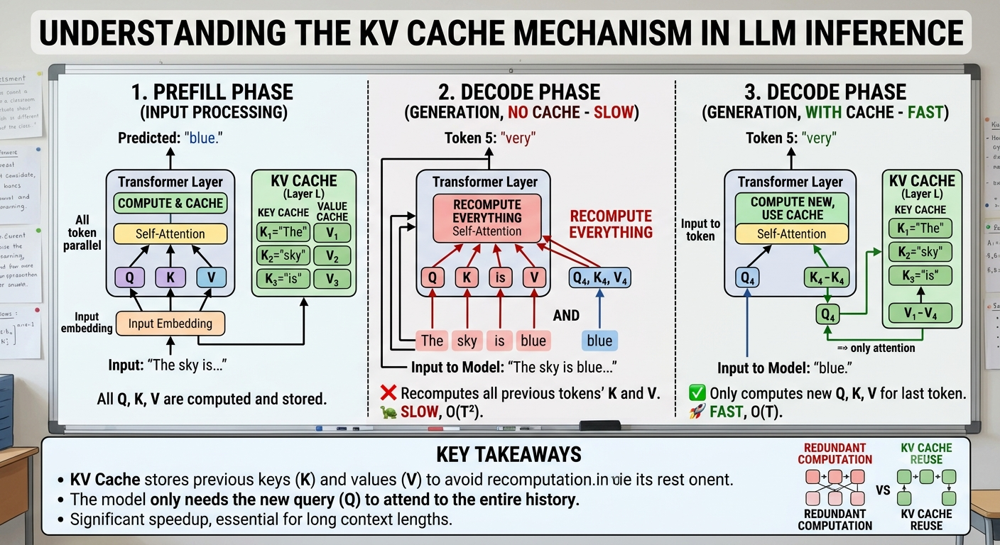
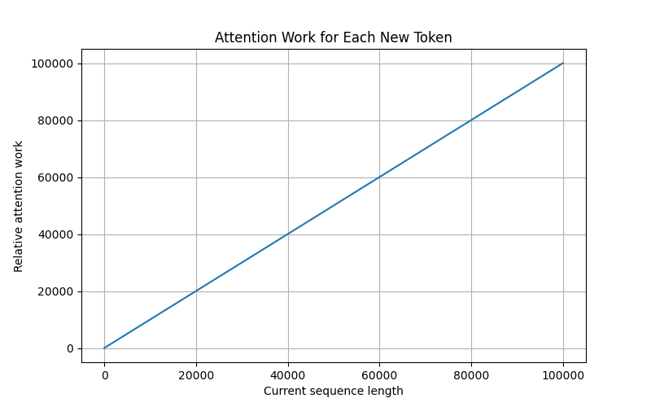

# K-V Cache

- [K-V Cache](https://www.youtube.com/post/Ugkxkku-e-0CMebE9yn0sKWPAyBr6q73T4Dv)



- [Vizuara video on how KV cache gets fragmented](https://www.youtube.com/shorts/XiQjAJa8REg)

- 🤔 Solution: paging (from the 1960s)

- Paged caches and sliding windows

- [Why longer chats take more time, relation to K-V cache](https://www.youtube.com/shorts/UjbbwDnqpMw)

- The K-V cache grows and a new word has to be `matched` or attention computed with each K-V cache entry

-                     KV CACHE
        ┌───────────────────────────────┐
        │ K1 V1 │ K2 V2 │ K3 V3 │ ... │ Kt Vt │
        └───────────────────────────────┘
             ↑       ↑       ↑          ↑
             │       │       │          │
             └───────┴───────┴──────────┘
                         │
                         │ attention
                         ▼
                      Q(t+1)
                         │
                         ▼
                   next token


- _Concept_ 🧩 🚀 The KV cache saves computation by avoiding recomputation of the past, but it does not make the past disappear.

-           PREFILL
    ┌───────────────────┐
    │ The cat sat on... │
    └───────────────────┘
             │
             ▼
       KV Cache built
             │
             ▼
       DECODE PHASE

        token 1
           ↓
        token 2
           ↓
        token 3
           ↓
        token 4
           ↓
          ...

    KV cache grows →


_Concept_ 🧩 🚀

KV cache:

Memory       → O(T)

Attention per new token:

Computation  → O(T)

Total decode attention:

Computation  → O(T²)


- Python code to show K-V cache grows with tokens in context

```python
import numpy as np
import matplotlib.pyplot as plt

# Context lengths
tokens = np.arange(0, 100_001, 1_000)

# Assume one KV entry per token
kv_size = tokens

plt.figure(figsize=(8, 5))
plt.plot(tokens, kv_size)

plt.xlabel("Number of tokens in context")
plt.ylabel("Relative KV cache size")
plt.title("KV Cache Size Grows Linearly with Context Length")
plt.grid(True)

plt.show()
```

- 

## MGQ, GQA

MHA   → very large
GQA   → much smaller
MQA   → dramatically smaller

- practical

Suppose we have:

32 attention heads

32 layers

head dimension 128

100,000 tokens

Compare:

Multi-Head Attention
H KV =32
Grouped-Query Attention
H KV =8
Multi-Query Attention
HKV =1

```python
models = {
    "MHA": 32,
    "GQA": 8,
    "MQA": 1
}

for name, kv_heads in models.items():

    memory = kv_cache_memory(
        layers=32,
        kv_heads=kv_heads,
        head_dim=128,
        sequence_length=100_000,
        bytes_per_element=2
    )

    print(
        name,
        f"{memory / 1e9:.2f} GB"
    )
```

- MHA

Q1 → K1 V1
Q2 → K2 V2
Q3 → K3 V3
Q4 → K4 V4


GQA

Q1 ─┐
Q2 ─┤
     ├→ K1 V1
Q3 ─┤
Q4 ─┘


MQA

Q1 ─┐
Q2 ─┤
Q3 ─┼→ K1 V1
Q4 ─┘


- _Concept_ 🧩 🚀 This gives a very intuitive reason for why modern LLM architectures often use GQA or MQA.
>The model can have many query heads while sharing fewer key/value heads.

- KV cache:

Memory       → O(T)

Attention per new token:

Computation  → O(T)

Total decode attention:

Computation  → O(T²)

- 🤔 This is one of the most important slides in the lecture.

## Practical

> Can we reproduce the intuition behind KV caching without running a 70-billion-parameter LLM?

- Simulate a KV cache

```python
import numpy as np

sequence_length = 10

# Simulate key and value vectors
keys = []
values = []

for t in range(sequence_length):

    key = np.random.randn(4)
    value = np.random.randn(4)

    keys.append(key)
    values.append(value)

    print(
        f"Token {t+1}: "
        f"KV cache contains {len(keys)} tokens"
    )
```


- Simulate attention

```python
import numpy as np

def attention(query, keys, values):

    keys = np.array(keys)
    values = np.array(values)

    # Query-key similarity
    scores = keys @ query

    # Softmax
    weights = np.exp(scores)
    weights = weights / weights.sum()

    # Weighted sum of values
    output = weights @ values

    return output, weights

keys = []
values = []

for t in range(10):

    key = np.random.randn(4)
    value = np.random.randn(4)

    keys.append(key)
    values.append(value)

    query = np.random.randn(4)

    output, weights = attention(
        query,
        keys,
        values
    )

    print(
        f"Step {t+1}: "
        f"attending over {len(keys)} tokens"
    )

```

New query
   │
   ▼
Compare against
K1 K2 K3 ... Kt
   │
   ▼
Attention weights
   │
   ▼
Retrieve from
V1 V2 V3 ... Vt

## Discussion question

> If the KV cache saves us from recomputing the past, why doesn't generation become constant-time?

- The answer should come from the students:

> Because the new token still has to attend over an increasingly large set of cached keys and values.

- So what would it take to make generation truly constant-time with respect to context length?

- This opens the door to:

sparse attention

local attention

sliding-window attention

recurrent architectures

state-space models

linear attention

memory compression

retrieval-based architectures

recurrent memory

hierarchical memory

> The KV cache is a compromise between remembering everything and recomputing everything.


- _Concept_ 🧩 🚀

> WITHOUT KV CACHE

Long history
     ↓
Repeated recomputation
     ↓
Huge computation cost


> WITH KV CACHE

Long history
     ↓
Store K and V
     ↓
Avoid recomputation
     ↓
But cache grows
     ↓
Every new query sees more history


THE FUNDAMENTAL TRADE-OFF

Memory  ↔  Computation


- _context length is not free_.

- A model advertised as having a 1M-token context window does not mean that 1M tokens are computationally equivalent to 1K tokens. 

- 💡 The model may accept the context, but the cost of storing, moving, and attending over that context can become substantial.

- This is also why application developers should think carefully about:

blindly sending entire chat histories,

excessive RAG retrieval,

unnecessarily large system prompts,

conversation summarization,

context pruning,

caching strategies,

and choosing the right context window.

- The practical engineering lesson is:

> A good LLM application is not necessarily the one that gives the model the most context. It is the one that gives the model the most useful context per unit of compute and memory.

- ⚠️ Something to remember

> KV caching eliminates the need to recompute the past, but it does not eliminate the cost of having a large past.

## 🎮 Practicals

- [Practicals](../practicals/kv_cache_huggingface_practical.ipynb)