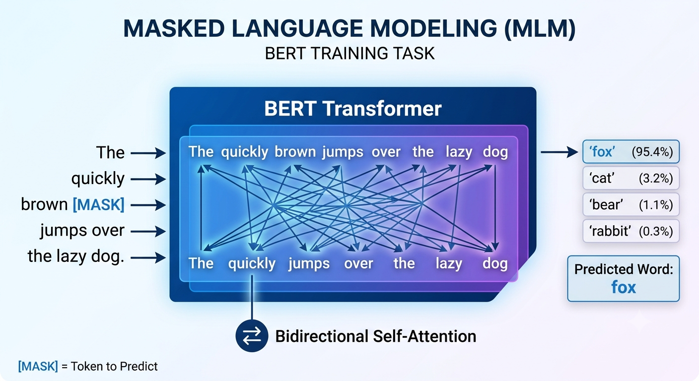
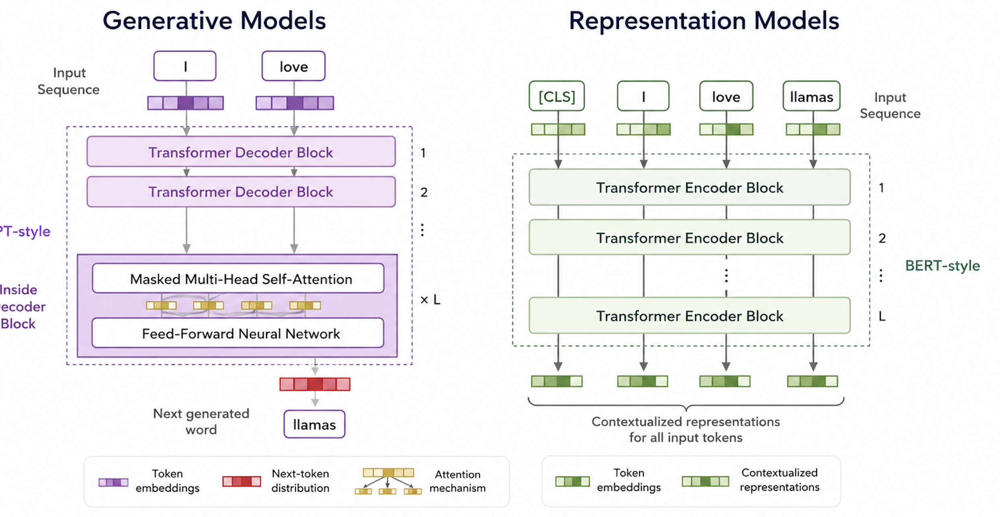

# Masked language modelling vs. Generative models

- [Jay Alammar deeplearning.ai video](http://learn.deeplearning.ai/courses/how-transformer-llms-work/lesson/hrpcy/understanding-language-models%3A-transformers)

## Representation models

- BERT

## Generative models

- Decoder only

- GPT-1

- masked self attention and decoder only

- Differences between the two kinds of models

