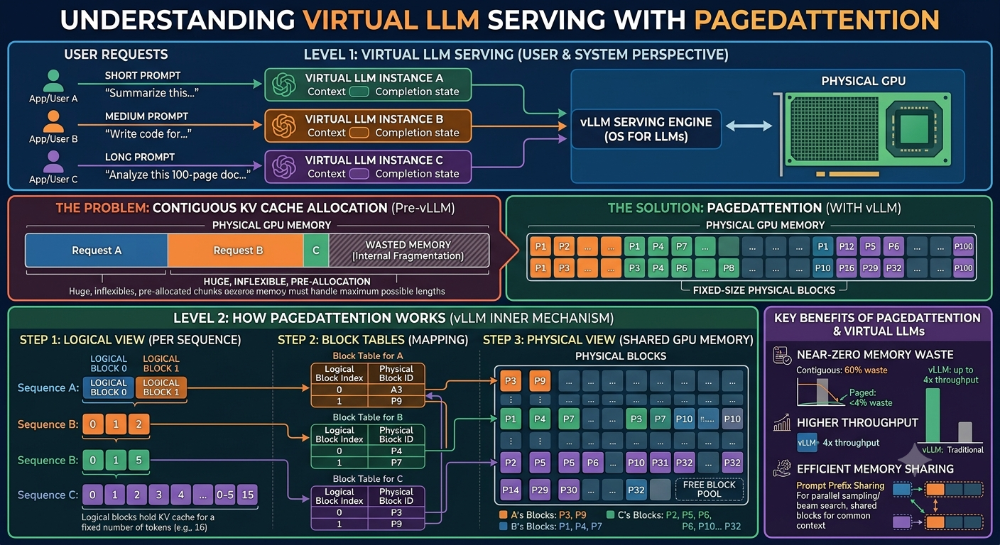
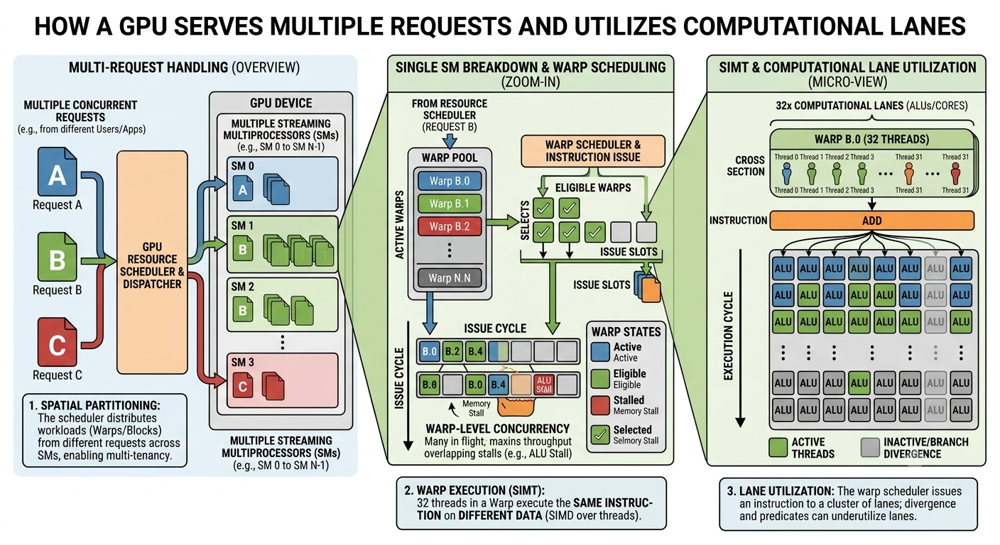

# Paged attention and vLLM (virtual LLM)

- [Video by Vizuara on vLLM](https://www.youtube.com/shorts/LHtLaKyTxoM)

- [Video by Vizuara on one GPU serving multiple requests](https://www.youtube.com/shorts/8EB4gJa3btg)

- vLLM (virtual LLM)

- [Vizuara video on how KV cache gets fragmented](https://www.youtube.com/shorts/XiQjAJa8REg)

- 🤔 Solution: paging (from the 1960s)

- an engine, not a model

- same model served to thousands of people on _same_ GPU

- KV cache

- every user gets their own KV cache

- on a busy GPU, KV cache gets bigger

- you can reserve a certain amount of KV cache for each user (for the longest possible answer), but you potentially waste space

- 💡 OS trick - operating systems faced and solved a similar problem (`virtual memory`)

- _Concept_ 🧩 🚀 Paged Attention

> Break up the KV cache into small pieces

- Virtual memory for the KV cache

- PagedAttention blocks

- [Video by Vizuara on one GPU serving multiple requests](https://www.youtube.com/shorts/8EB4gJa3btg)

