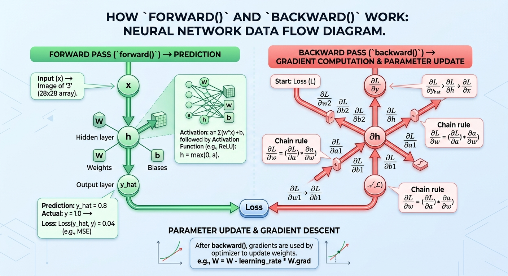

# PyTorch Core Mechanics: Deep Dive into `forward()` and `backward()`

A comprehensive guide for students and instructors explaining the internal workings, data flow, dynamic graph construction, and automatic differentiation engine in PyTorch.

---




# PyTorch resources

- [Basics of PyTorch](https://github.com/neelsoumya/teaching_intro_pytorch)
- [Basic for ANN in PyTorch](https://github.com/neelsoumya/teaching_intro_pytorch/blob/main/03_nn.py)

## 1. Executive Summary & Core Philosophy

In PyTorch, model training relies on two foundational, complementary operations:
1. **The Forward Pass (`forward()`)**: Transforms input tensors through layered mathematical operations to yield predictions and calculates a scalar loss value. Concurrently, PyTorch dynamically constructs a Directed Acyclic Graph (DAG) tracking all performed operations.
2. **The Backward Pass (`backward()`)**: Traverses the dynamically created computational graph in reverse (from output loss to input parameters), computing exact gradients via reverse-mode automatic differentiation (the Chain Rule) and populating tensor `.grad` attributes.

```
       FORWARD PASS (Data & Graph Building)
  Input (x)  ──────►  Layers / Modules  ──────►  Prediction (ŷ) ──────► Loss (L)
                                                                            │
                                                                            │ loss.backward()
       BACKWARD PASS (Gradient Backpropagation)                             ▼
  ∂L/∂W       ◄──────  Chain Rule  ◄──────────  Grad Engine  ◄──────────────┘
```

---

## 2. The Forward Pass (`forward()`)

### 2.1 What Happens During `forward()`?
When input data is passed through a PyTorch `nn.Module`, the model computes output values layer by layer. Beyond simple mathematical evaluation, the forward pass performs key infrastructure setup:

* **Tensor Computation**: Executes matrix multiplications, convolutions, bias additions, and non-linear activations (e.g., ReLU, Softmax).
* **Dynamic Computational Graph Construction**: For every operation involving tensors with `requires_grad=True`, PyTorch appends a node to an execution graph.
* **State & Activation Caching**: Saves intermediate values (such as pre-activation hidden states) required later for derivative calculations during the backward pass.

### 2.2 Calling Syntax: `model(x)` vs `model.forward(x)`

> **Important Teaching Note:** Always invoke modules using `model(x)` rather than calling `model.forward(x)` directly.

```python
# PREFERRED (Executes PyTorch module hooks and state tracking):
output = model(inputs)

# AVOID (Bypasses PyTorch internal hooks, profiling, and pre/post-forward handles):
output = model.forward(inputs)
```

When calling `model(inputs)`, Python calls `nn.Module.__call__()`, which handles:
1. Executing registered `forward_pre_hooks`.
2. Invoking your custom `forward()` implementation.
3. Executing registered `forward_hooks`.
4. Registering target output dependencies for backward computation.

---

## 3. The Dynamic Computational Graph (DAG)

Unlike static graph frameworks, PyTorch uses **Define-by-Run** dynamic computational graphs. The graph is built on-the-fly during the forward pass and destroyed after the backward pass.

### 3.1 Anatomy of Graph Nodes

Every tensor created by an operation carries a reference to its creator function via `grad_fn`:

* **Leaf Tensors**: User-created tensors or trainable parameters ($W$, $b$) created directly. They have `grad_fn = None` and `requires_grad = True`.
* **Intermediate Tensors**: Tensors produced by operations (e.g., $h = Wx + b$). They store a `grad_fn` point matching the operation (e.g., `<AddBackward0>`, `<MmBackward0>`).

```
  [ W (Leaf) ] ──┐
                 ├──► [ mm() ] ──► [ Tensor h ] ──► [ Relu() ] ──► [ Tensor a ] ──► Loss (L)
  [ x (Input) ] ─┘   (MmBackward)                  (ReluBackward)
```

---

## 4. The Backward Pass (`backward()`)

### 4.1 Triggering Automatic Differentiation (Autograd)
Calling `loss.backward()` initiates reverse-mode automatic differentiation starting from the scalar loss node $L$.

### 4.2 Application of the Calculus Chain Rule
The autograd engine traverses the graph backward from output to inputs. At each node, it computes local partial derivatives and multiplies them by incoming gradient signals from upstream nodes.

#### Mathematical Formulation:
For a simple multi-layer sequence $h = Wx + b$, $a = \sigma(h)$, and $L = 	ext{Loss}(a, y)$:

1. **Upstream Gradient at Output**:
   $$rac{\partial L}{\partial a}$$

2. **Gradient Through Activation $\sigma(h)$**:
   $$rac{\partial L}{\partial h} = rac{\partial L}{\partial a} \cdot \sigma'(h)$$

3. **Gradient With Respect to Weights $W$**:
   $$rac{\partial L}{\partial W} = rac{\partial L}{\partial h} \cdot x^T$$

4. **Gradient With Respect to Biases $b$**:
   $$rac{\partial L}{\partial b} = rac{\partial L}{\partial h}$$

### 4.3 Gradient Storage & Accumulation
Unlike standard assignments, PyTorch **accumulates** (adds) gradients into `.grad`:

$$	ext{tensor.grad} \leftarrow 	ext{tensor.grad} + 	ext{new\_gradient}$$

Because gradients accumulate, you must explicitly clear them before starting a new optimization iteration using `optimizer.zero_grad()`.

---

## 5. Summary Table: Forward vs. Backward

| Feature / Aspect | Forward Pass (`forward()`) | Backward Pass (`backward()`) |
| :--- | :--- | :--- |
| **Primary Goal** | Generate predictions ($\hat{y}$) & calculate Loss ($L$) | Calculate gradients ($rac{\partial L}{\partial W}$) for parameters |
| **Direction of Data** | Input $
ightarrow$ Layers $
ightarrow$ Prediction $
ightarrow$ Loss | Loss $
ightarrow$ Layers $
ightarrow$ Parameters |
| **Graph Action** | **Builds** the Dynamic DAG | **Traverses** and **Frees** the Dynamic DAG |
| **Primary PyTorch Trigger** | `model(x)` / `criterion(y_hat, y)` | `loss.backward()` |
| **Underlying Engine** | Python module execution & C++ Catenation | C++ `torch::autograd` Engine |
| **Memory Impact** | Allocates tensor activations in VRAM/RAM | Frees intermediate activation graph memory |
| **Parameter Impact** | Parameters remain unchanged | Gradients populate `param.grad` (Parameters not updated yet) |

---

## 6. The Complete Training Step Workflow

A standard training loop brings `forward()`, `backward()`, and parameter updating together in a precise 4-step cadence:

```python
import torch
import torch.nn as nn
import torch.optim as optim

# Sample Model Definition
class SimpleMLP(nn.Module):
    def __init__(self, input_dim, hidden_dim, output_dim):
        super(SimpleMLP, self).__init__()
        self.fc1 = nn.Linear(input_dim, hidden_dim)
        self.relu = nn.ReLU()
        self.fc2 = nn.Linear(hidden_dim, output_dim)

    def forward(self, x):
        h = self.fc1(x)
        a = self.relu(h)
        out = self.fc2(a)
        return out

# Instantiate Model, Loss Function, and Optimizer
model = SimpleMLP(input_dim=10, hidden_dim=32, output_dim=1)
criterion = nn.MSELoss()
optimizer = optim.SGD(model.parameters(), lr=0.01)

# Dummy Input and Target
inputs = torch.randn(8, 10)
targets = torch.randn(8, 1)

# --- SINGLE TRAINING ITERATION ---

# STEP 1: Clear previous step gradients
# Sets all param.grad values to None/0 to prevent unwanted gradient accumulation
optimizer.zero_grad()

# STEP 2: Forward Pass
# Evaluates network layers, caches intermediate states, constructs dynamic graph
predictions = model(inputs)
loss = criterion(predictions, targets)

# STEP 3: Backward Pass
# Traverses graph from loss back to parameters, computes derivatives via Chain Rule
loss.backward()

# STEP 4: Optimizer Step (Parameter Update)
# Adjusts parameters using stored gradients: W = W - lr * W.grad
optimizer.step()
```

---

## 7. Common Pitfalls & Instructor FAQ

### Q1: Why do we call `optimizer.zero_grad()` before `loss.backward()`?
> **Answer:** PyTorch accumulates gradients into `.grad` by default. If `zero_grad()` is omitted, gradients from the current batch will add to gradients from previous batches, leading to incorrect gradient magnitudes and divergent training.

### Q2: What happens if I call `loss.backward()` twice?
> **Answer:** PyTorch frees the computational graph immediately after `backward()` executes to conserve memory. Calling `backward()` a second time will raise a `RuntimeError: Trying to backward through the graph a second time...` unless `loss.backward(retain_graph=True)` was specified.

### Q3: Why does `loss.backward()` not update model weights?
> **Answer:** Decoupling gradient calculation from parameter updates provides modularity. `loss.backward()` strictly computes derivatives and stores them in `param.grad`. The `optimizer.step()` function uses these stored gradients according to a specific optimization algorithm (SGD, Adam, AdamW, etc.).
