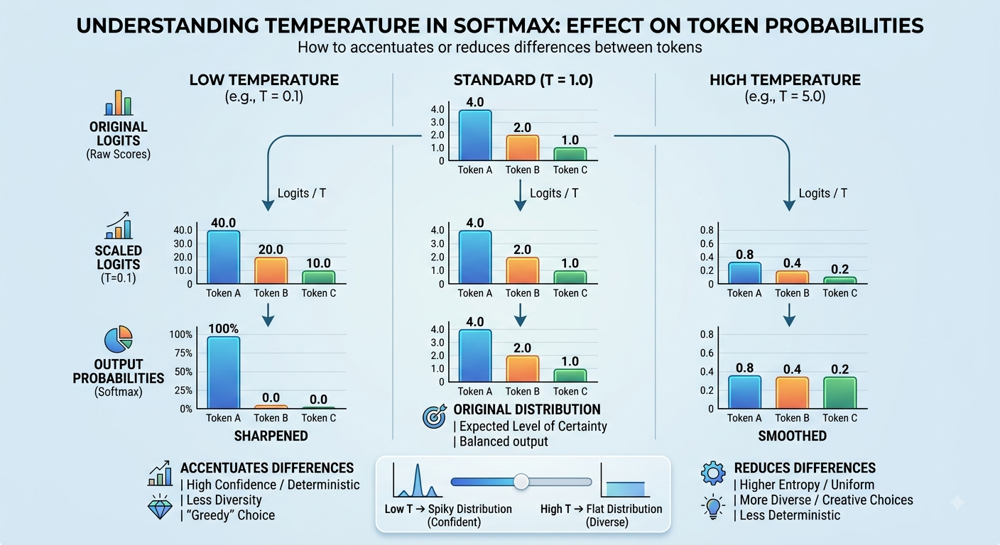
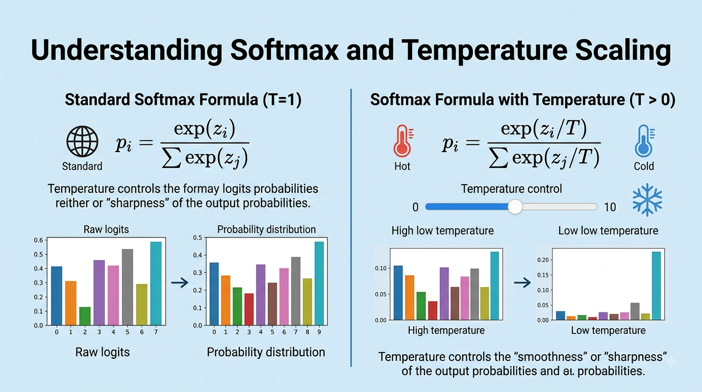

# Softmax and temperature

$$softmax(x) = \frac{e^{x_i}}{\sum_j e^{x_j}}$$   

- Intuition: turns logits into a probability distribution 

- Why we need it? To convert raw logits into probabilities that sum to 1. 

## 🤔 ❓ Question for class

- 🤔 ❓[What happens when you delete the first token and the relationship with softmax. Video by Vizuara on Youtube](https://www.youtube.com/shorts/nMU1-prYcO0)

- `softmax` learns to dump attention on first token

- if you remove that token what happens to the model? Does it change the subsequent token predictions?

- nowadays there is a dedicated `sink token` token used to improve training stability


## Recent improvements to Softmax

- 🤔 What do you think softmax can be improved on?

- _Hint_: it has an exponential and a division. Can you think of alternatives?

- see [architecture](architecture.md) for more tricks on how to make _softmax_ better

## Temperature

- Temperature is just a hyperparameter that scales the logits before applying softmax.

- It controls the randomness of the model's predictions.
- Formula: 

- [🎥 Video by Vizuara](https://www.youtube.com/shorts/uyYltOvcn1E)

## Practical

- paste the following code into Google Colab and play around with the sliders

- or click on the link [here](../practicals/temperature.ipynb)

- or [here](https://colab.research.google.com/drive/10YghsVmmNwpAhhcGJNmvFwXIz8-pPDRg?usp=sharing)

```python
import numpy as np
import matplotlib.pyplot as plt
from ipywidgets import interact, FloatSlider

# Sample tokens and raw logits (unnormalized log-probabilities)
tokens = ['Cat', 'Dog', 'Car', 'Airplane', 'Tree']
logits = np.array([3.5, 2.8, 1.2, 0.5, -1.0])

def softmax_with_temperature(logits, temperature):
    # Clamp temperature to avoid division by zero
    temp = max(temperature, 1e-5)
    # Scaled logits with numerical stability adjustment
    scaled_logits = logits / temp
    exp_logits = np.exp(scaled_logits - np.max(scaled_logits))
    return exp_logits / np.sum(exp_logits)

def plot_interactive(temperature=1.0):
    probs = softmax_with_temperature(logits, temperature)
    
    fig, (ax1, ax2) = plt.subplots(1, 2, figsize=(13, 4.5))
    
    # 1. Plot Raw Logits
    bars1 = ax1.bar(tokens, logits, color='#4C72B0', edgecolor='black', alpha=0.85)
    ax1.set_title('1. Raw Logits ($z_i$)', fontsize=13, fontweight='bold')
    ax1.set_ylabel('Score')
    ax1.grid(axis='y', linestyle='--', alpha=0.5)
    
    for bar in bars1:
        yval = bar.get_height()
        ax1.text(bar.get_x() + bar.get_width()/2, yval + 0.1, f"{yval:.1f}", ha='center', va='bottom')

    # 2. Plot Output Probabilities
    bars2 = ax2.bar(tokens, probs, color='#DD8452', edgecolor='black', alpha=0.85)
    ax2.set_title(f'2. Softmax Probabilities ($T = {temperature:.2f}$)', fontsize=13, fontweight='bold')
    ax2.set_ylabel('Probability')
    ax2.set_ylim(0, 1.1)
    ax2.grid(axis='y', linestyle='--', alpha=0.5)
    
    for bar in bars2:
        yval = bar.get_height()
        ax2.text(bar.get_x() + bar.get_width()/2, yval + 0.02, f"{yval*100:.1f}%", ha='center', va='bottom')

    plt.tight_layout()
    plt.show()

# Render interactive widget
interact(
    plot_interactive,
    temperature=FloatSlider(
        value=1.0,
        min=0.05,
        max=3.0,
        step=0.05,
        description='Temp (T):',
        style={'description_width': 'initial'},
        layout={'width': '500px'}
    )
);
```