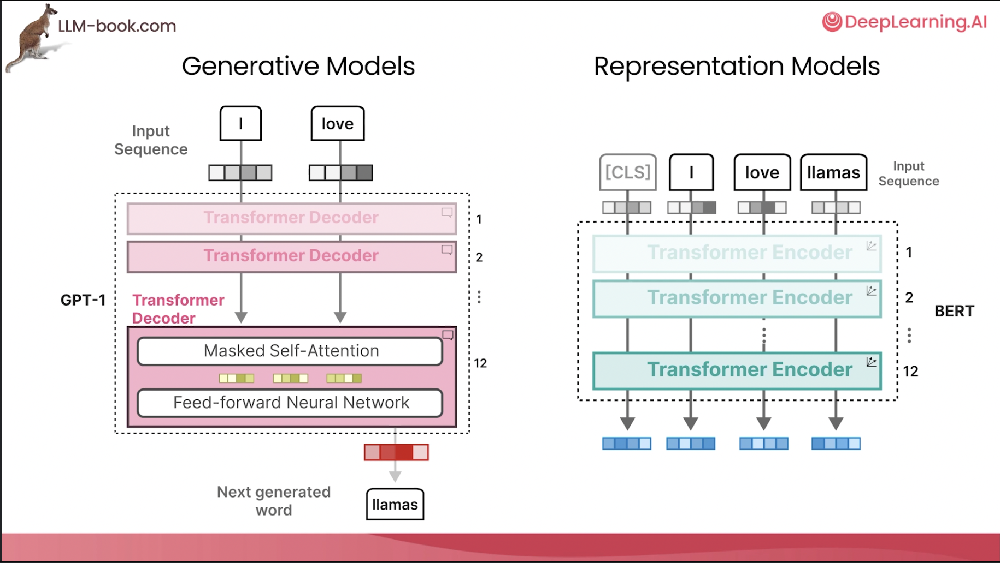
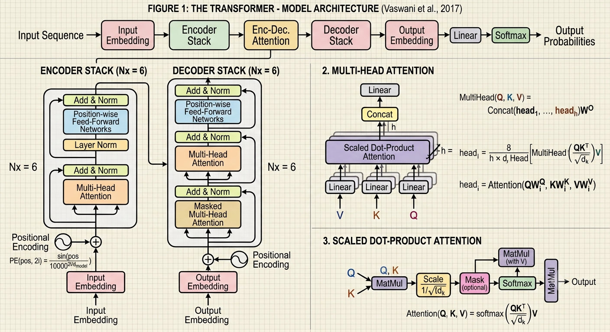
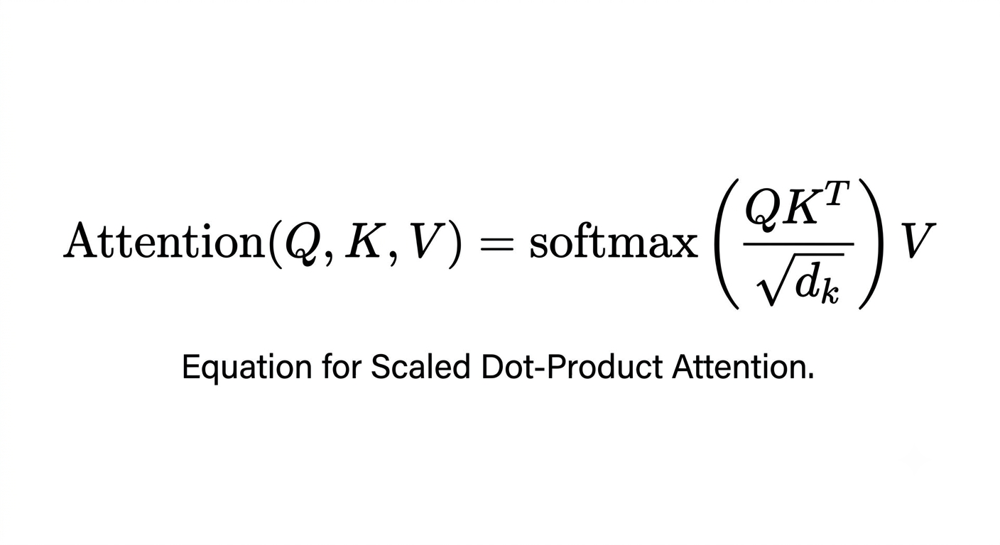

# Transformers

## Practical
- Practical instructions:

- Run [notebook](https://github.com/neelsoumya/teaching_llm_applications/blob/main/practicals/transformer.ipynb) in Google Colab

- or locally using the following instructions

```bash

    git clone https://github.com/neelsoumya/teaching_llm_applications
    
    cd teaching_llm_applications

    python3 -m venv venv_llm

    source venv_llm/bin/activate

    pip install -r requirements.txt

    jupyter notebook
```


## Theory

- _Concept_ 🧩 🚀 A Transformer is a sequence-to-sequence encoder-decoder model similar to the model in the [neural machine translation with attention tutorial](https://www.tensorflow.org/text/tutorials/nmt_with_attention). 

- A single-layer Transformer takes a little more code to write, but is almost identical to that encoder-decoder RNN model. 

- The only difference is that the RNN layers are replaced with self-attention layers. 

- This [tutorial](https://www.tensorflow.org/text/tutorials/transformer) builds a 4-layer Transformer which is larger and more powerful, but not fundamentally more complex.

- Why transformers are better than RNNs? Parallelizeable. Memory.

- [Code, material and slides](https://www.tensorflow.org/text/tutorials/transformer)

- [Jay Alammar deeplearning.ai course](https://learn.deeplearning.ai/courses/how-transformer-llms-work/lesson/hrpcy/understanding-language-models%3A-transformers)

- [keras transformers lecture and practical: VERY GOOD](https://www.tensorflow.org/text/tutorials/transformer)

- [positional encoding](https://www.tensorflow.org/text/tutorials/transformer)

## Intro to transformers (Jay Alammar course)

- [🎥Jay Alammar deeplearning.ai course](https://learn.deeplearning.ai/courses/how-transformer-llms-work/lesson/hrpcy/understanding-language-models%3A-transformers)

- generative models vs. representational models:



- **Generative models** (like GPT):
- These models are trained to _generate_ new content, such as text, images, audio, or code.
- They learn the probability distribution of the data and can produce novel outputs that resemble the training data.
- Examples: GPT-3/4 (text), DALL-E, Stable Diffusion (images).


- **Representational models**: 
- These models are trained to _understand_ and _represent_ data in a meaningful way, without necessarily generating new content.
- They learn features and patterns in the data, creating embeddings (numerical representations) that capture semantic meaning.
- These representations can be used for various downstream tasks like classification, clustering, similarity search, etc.
- Examples: Word2Vec, BERT, Sentence Transformers (text embeddings), Contrastive learning models (image representation).

- [🎥 context length (video by _3blue1brown_)](https://www.youtube.com/watch?v=wjZofJX0v4M)

- [🎥 attention in transformers (video by _3blue1brown_)](https://www.youtube.com/watch?v=eMlx5fFNoYc&pp=ugUHEgVlbi1VUw%3D%3D)

- [🎥 Key _Concept_ 🧩 🚀 learn embeddings from the data Stanford CME295](https://youtu.be/Ub3GoFaUcds?si=uKt6OLPhgM4d_oE-&t=2261)

- [🎥 Key _Concept_ attention in transformers Stanford CME295](https://youtu.be/Ub3GoFaUcds?si=3wcDTsgvQO17E6PU&t=4042)

- _Concept_ 🧩 🚀 Query Key Value: what tokens are similar to _teddy bear_

- _Concept_ 🧩 🚀 _key_ which one is most similar and _value_ is the value

- _dot product_ between `query` and `key` gives the similarity

- all tokens will attend to one another to produce the final context-aware token embedding 

- [🎥 Video on Transformer architecture Stanford CME295](https://youtu.be/Ub3GoFaUcds?si=QCLOOxgVPoxZCFxx&t=4449)

- first is encoder

- second is decoder: query from decoder, keys and values from encoder

- self attention on decoder side as well (causal mask): what words predicted till now and how it can help in predicting next token


- cross attention: what has been seen in the inputs

- _Attention layer_ helps in computing embeddings of tokens based on the context

- _multi-head attention_ layer helps in capturing different types of relationships between tokens

- _Feed forward layer_ helps in processing the attention outputs

- While the self-attention mechanism computes contextual relationships across tokens, the position-wise feed-forward network (FFN) operates on each token independently to perform non-linear feature transformation and store parametric knowledge. Functioning typically as a two-layer perceptron that expands the hidden dimension (e.g., from $d_{\text{model}}$ to $4d_{\text{model}}$) before projecting it back, the FFN applies non-linear activation functions (such as GELU or SwiGLU) to act as an associative key-value memory, retrieving factual information and higher-level concepts. In essence, while self-attention determines how information is gathered across sequence positions, the FFN processes and synthesizes that gathered context within each token representation.

- all concepts explained in one diagram:



## Deep dive

- [text from Google AI blog](https://ai.googleblog.com/2017/08/transformer-novel-neural-network.html)

> Neural networks for machine translation typically contain an encoder reading the input sentence and generating a representation of it. A decoder then generates the output sentence word by word while consulting the representation generated by the encoder. The Transformer starts by generating initial representations, or embeddings, for each word... Then, using self-attention, it aggregates information from all of the other words, generating a new representation per word informed by the entire context, represented by the filled balls. This step is then repeated multiple times in parallel for all words, successively generating new representations.


- 

- _Concept_ 🧩 🚀 Unlike recurrent neural networks (RNNs), Transformers are parallelizable. This makes them efficient on hardware like GPUs and TPUs. The main reasons is that Transformers replaced recurrence with attention, and computations can happen simultaneously. Layer outputs can be computed in parallel, instead of a series like an RNN.

- _Concept_ 🧩 🚀 Unlike RNNs (such as seq2seq, 2014) or convolutional neural networks (CNNs) (for example, ByteNet), Transformers are able to capture distant or long-range contexts and dependencies in the data between distant positions in the input or output sequences. Thus, longer connections can be learned. 

> Attention allows each location to have access to the entire input at each layer, while in RNNs and CNNs, the information needs to pass through many processing steps to move a long distance, which makes it harder to learn.

## Basics of RNNs

- [Basics of RNNs](https://www.tensorflow.org/text/tutorials/text_generation)

> RNNs, on the other hand, lack any mechanism to refer back to a previous section of a sequence directly. All information must, by design, be passed through an RNN cell’s internal state in a loop, through every position in a sequence. It’s a bit like finishing this book, closing it, and trying to implement that weather prediction model entirely from memory.

## Basics of transformers (VERY GOOD)

- [Code and tutorial by Francois](https://deeplearningwithpython.io/chapters/chapter15_language-models-and-the-transformer/)


## Architectures

- 

- 

## Basics

- an integer sequence as a natural numeric representation for text.

- `tokenizing` a string, where we split inputs into tokens and map each token to an int.

- `detokenize` a sequence by proceeding in reverse — map ints back to string tokens and join them together

- our problem becomes building a model that can predict an integer sequence of tokens.

> The simplest option to consider might be to train a direct classifier over the space of all possible output integer sequences, but some back-of-the-envelope math will quickly show this is intractable. With a vocabulary of 20,000 words, there are 20,000 ^ 4, or 160 quadrillion possible 4-word sequences, and fewer atoms in the universe than possible 20-word sequences. Attempting to represent every output sequence as a unique classifier output would overwhelm compute resources no matter how we design our model.

-  A _language model_ is a model that learns a : `p(token|past tokens)`

## Practical 1

- [See RNN and GRU practical](https://deeplearningwithpython.io/chapters/chapter15_language-models-and-the-transformer/)

- nanoGPT

- Google Colab

- Huggingface spaces

## Decoder and Encoder

- [Encoder vs. decoder](encoder_decoder.md)

> During training, the following happens:

- An encoder model turns the source sequence into an intermediate representation.
- A decoder is trained using the language modeling setup we saw previously. It will recursively predict the next token in the target sequence by looking at all previous target tokens and our encoder’s representation of the source sequence.

- During inference we don’t have access to the target sequence — we’re trying to predict it from scratch. We will generate it one token at a time, just as we did with our Shakespeare generator:

- We obtain the encoded source sequence from the encoder.

- The decoder starts by looking at the encoded source sequence as well as an initial “seed” token (such as the string "[start]") and uses them to predict the first real token in the sequence.
- The predicted sequence so far is fed back into the decoder, in a loop, until it generates a stop token (such as the string "[end]").


- [🤗 Huggingface resources on transformers](https://huggingface.co/learn/llm-course/chapter1/4)

## Attention

- _Concept_ 🧩 🚀 Concept behind attention

- Some concepts and text from an [online book](https://deeplearningwithpython.io/chapters/chapter15_language-models-and-the-transformer/)

> humans can be selective and contextual in how we pull information from text.

> The idea with attention is to build a mechanism by which a neural network can give more weight to some part of a sequence and less weight to others contextually, depending on the current input being processed


> With attention, our goal is to give the model a way to score every single vector in our source sequence based on its relevance to the current word we are trying to predict


## Eigensum

- [Eigensum and dot product notation form Francois Chollet's online book (Chapter 15)](https://deeplearningwithpython.io/chapters/chapter15_language-models-and-the-transformer/)

> For attention to work well, we want to avoid passing information about important tokens through a loop potentially as long as our combined source and target sequence length — this is where RNNs start to fail. A simple way to do this is to take a weighted sum of all the source vectors based on this score we will compute. It would also be convenient if the sum of all attention scores for a given target were 1, as this would give our weighted sum a predictable magnitude. We can achieve this by running the scores through a softmax function — something like this, in NumPy pseudocode:

```python
scores = [score(target, source) for source in sources]
scores = softmax(scores)
combined = np.sum(scores * sources)
```

> But how should we compute this relevance score? When researchers first worked with attention, this question was a big topic of inquiry. It turns out that one of the most straightforward approaches is best. We can use a dot-product as a simple measure of the distance between target and source vectors. If the source and target vectors are close together, we assume that means the source token is relevant to our prediction. 

> We can make our snippet more complete by handling the entire target sequence at once — it will be equivalent to running our previous snippet in a loop for each token in the target sequence. When both target and source are sequences, the attention scores will be a matrix. Each row represents how much a target word will value a source word in the weighted sum (see figure 15.5). We will use the Einsum notation as a convenient way to write the dot-product and weighted sum:

```python
def dot_product_attention(target, source):
    # Takes the dot-product between all target and source vectors,
    # where b = batch size, t = target length, s = source length, and d
    # = vector size
    scores = np.einsum("btd,bsd->bts", target, source)
    scores = softmax(scores, axis=-1)
    # Computes a weighted sum of all source vectors for each target
    # vector
    return np.einsum("bts,bsd->btd", scores, source)

dot_product_attention(target, source)
```


- _Concept_ 🧩 🚀 `parameterized attention`
> much richer if we give the model parameters to control the attention score. If we project both source and target vectors with Dense layers, the model can find a good shared space where source vectors are close to target vectors if they help the overall prediction quality. Similarly, we should allow the model to project the source vectors into an entirely separate space before they are combined and once again after the summation.

- _Concept_ 🧩 🚀 key-value pairs

> We can also adopt a slightly different naming for inputs that has become standard in the field. What we just wrote is roughly summarized as sum(score(target, source) * source). We will write this equivalently with different input names as sum(score(query, key) * value). This three-argument version is more general — in rare cases, you might not want to use the same vector to score your source inputs as you use to sum your source inputs.

> The terminology comes from search engines and recommender systems. Imagine a search tool to look up photos in a database — the “query” is your search term, the “keys” are photo tags you use to match with the query, and finally, the “values” are the photos themselves (figure 15.6). The attention mechanism we are building is roughly analogous to this sort of lookup.


- parameterized attention using our new key-value pairs

```python
query_dense = layers.Dense(dim)
key_dense = layers.Dense(dim)
value_dense = layers.Dense(dim)
output_dense = layers.Dense(dim)

def parameterized_attention(query, key, value):
    query = query_dense(query)
    key = key_dense(key)
    value = value_dense(value)
    scores = np.einsum("btd,bsd->bts", query, key)
    scores = softmax(scores, axis=-1)
    outputs = np.einsum("bts,bsd->btd", scores, value)
    return output_dense(outputs)

parameterized_attention(query=target, key=source, value=source)
```

- This block is a perfectly functional attention mechanism! We just wrote a function that will allow the model to pull information from anywhere in the source sequence, contextually, depending on the target word we are decoding.

> The “Attention is all you need” authors made two more changes to our mechanism through trial and error. The first is a simple scaling factor. When input vectors get long, the dot-product scores can get quite large, which can affect the stability of our softmax gradients. The fix is simple: we can scale down our softmax scores slightly. Scaling by the square root of the vector length works well for any vector size.

Here is the equation for the Scaled Dot-Product Attention mechanism as described by the authors. In this formula, the dot product of the queries ($Q$) and keys ($K$) is divided by the square root of the dimension of the keys ($d_k$), which is the specific scaling factor they found to improve gradient stability.




> The other has to do with the expressivity of the attention mechanism. The softmax sum we are doing is powerful — it allows a direct connection across distant parts of a sequence. But the summation is also blunt: if the model tries to attend to too many tokens at once, the interesting features of individual source tokens will get “washed out” in the combined representation. A simple trick that works well is to do this attention operation several times for the same sequence, with several different attention heads running the same computation with different parameters:

```python
query_dense = [layers.Dense(head_dim) for i in range(num_heads)]
key_dense = [layers.Dense(head_dim) for i in range(num_heads)]
value_dense = [layers.Dense(head_dim) for i in range(num_heads)]
output_dense = layers.Dense(head_dim * num_heads)

def multi_head_attention(query, key, value):
    head_outputs = []
    for i in range(num_heads):
        query = query_dense[i](query)
        key = key_dense[i](key)
        value = value_dense[i](value)
        scores = np.einsum("btd,bsd->bts", target, source)
        scores = softmax(scores / math.sqrt(head_dim), axis=-1)
        head_output = np.einsum("bts,bsd->btd", scores, source)
        head_outputs.append(head_output)
    outputs = ops.concatenate(head_outputs, axis=-1)
    return output_dense(outputs)

multi_head_attention(query=target, key=source, value=source)
```

> By projecting the query and key differently, one head might learn to match the subject of the source sentence, while another head might attend to punctuation. This multi-headed attention avoids the limitation of needing to combine the entire source sequence with a single softmax sum


- In `Keras` you will use the `MultiHeadAttention` layer:

```python
multi_head_attention = keras.layers.MultiHeadAttention(
    num_heads=num_heads,
    head_dim=head_dim,
)
multi_head_attention(query=target, key=source, value=source)
```

> However, the authors of “Attention is all you need” realized you could go further and use attention as a general mechanism for handling all sequence data in a model. Although so far we have only looked at attention as a way to handle information passing between two sequences, you could also use attention as a way to let a sequence attend to itself:

```python
multi_head_attention(key=source, value=source, query=source)
```

> This is called self-attention, and it is quite powerful. With self-attention, each token can attend to every token in its own sequence, including itself, allowing the model to learn a representation of the word in context.

> Consider an example sentence: “The train left the station on time.” Now, consider one word in the sentence: “station.” What kind of station are we talking about? Could it be a radio station? Maybe the International Space Station? With self-attention, the model could learn to give a high attention score to the pair of “station” and “train,” summing the vector used to represent “train” into the representation of the word “station.”


## 🎮 Practicals

- 🎮 [code](https://www.tensorflow.org/text/tutorials/transformer)

- 🎮 [keras transformers](https://keras.io/examples/nlp/text_classification_with_transformer/)